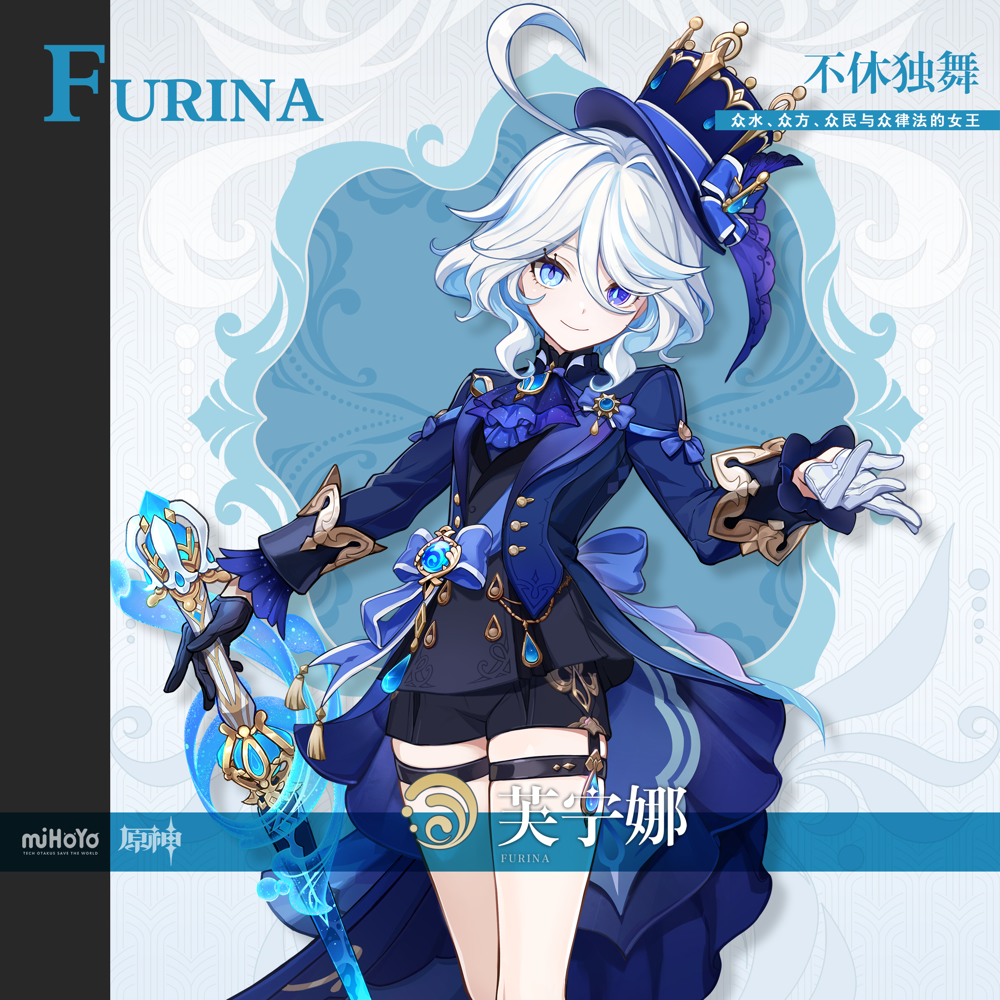
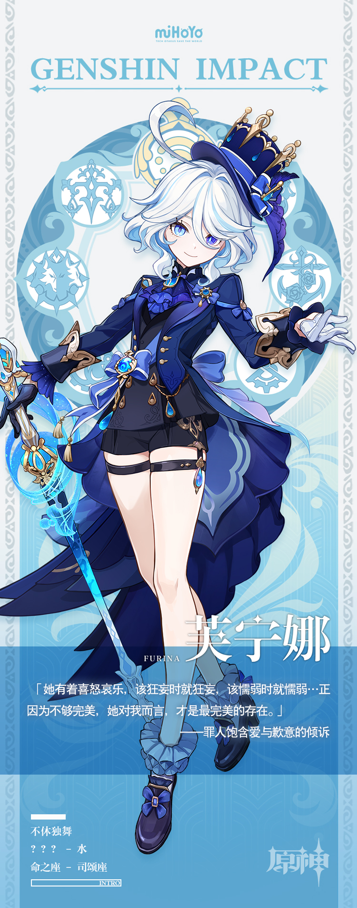

# 永世领唱，无尽圆舞

随着质疑的声音如沸水般升腾，她不得不拿出更高昂与强硬的姿态去回击。

如此同时她还必须专注于手中的职责，不能因为情绪的波动而露出破绽。

古老预言中记录的灾难正在逐步逼近，神明此时应该拿出怎样的对策，她比谁都更想知道。

旁人眼中的她心不在焉，神情憔悴，她却坚称只是没有睡好，作为受人敬仰与爱戴的女王，怎么会在意这些琐碎的杂音？

是啊，无论现状再怎么混乱与紧急，都不能自乱阵脚，让长年以来的努力付诸东流。

被大家所爱的，这歌剧院唯一的主角…

孤独也好，无助也好，痛苦也好，悲伤也好，即便是将世间的苦难都聚于一身…

守护枫丹所有人类的心，从来没有改变。