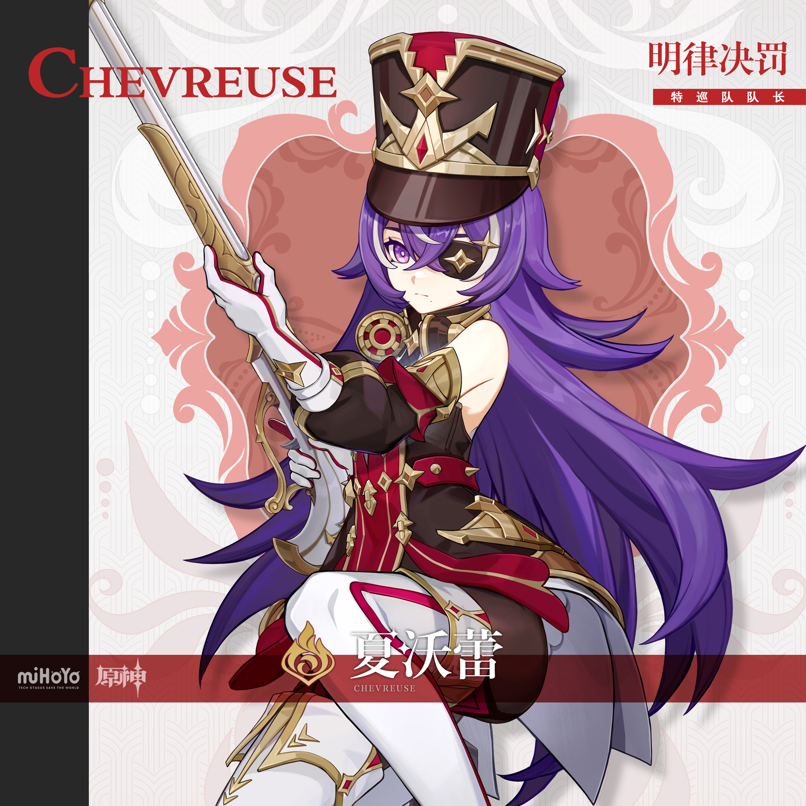
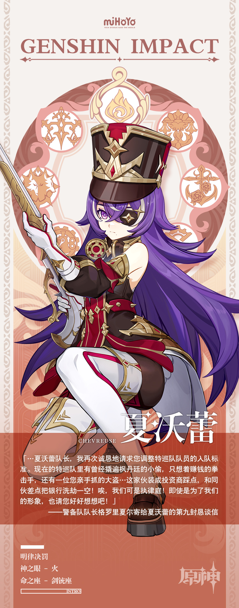

# 知刑执法，公义责罪

「再调皮的话，就要被特巡队抓走了！」

——枫丹的家长们经常用这句话来教训自家不听话的孩子。

彼时尚且稚嫩的孩子们当然还不明白，特巡队队员绝对不可能因为孩子们上床睡觉太迟，刷牙之后偷吃零食，或是学习成绩太差的原因而专程来训斥他们。能让特巡队队员出动的人，只可能是那些恶名昭彰的凶犯。而随着孩子们长大，真正认识到特巡队的职责后，这句教训也会随之失去效用。

…不过，当看着街上的孩子们悄悄躲开自己时，一些特巡队队员还是不免对这种「教育方式」有些不忿，他们认为，用如此说法来形容特巡队实在太过不妥。放任大家这么念叨下去，那特巡队的「凶名」就要成为笼罩在每一位枫丹孩子们心头上，不知道何时才能散去的乌云了。

「这样倒也不错。」

处理着公文的特巡队队长夏沃蕾却如此说道。

「希望他们能永远牢记住这个『凶名』，并且理解『凶名』背后的含义…」

「…这样的话，我也许就不用在将来的某天，真的将他们抓走了。」