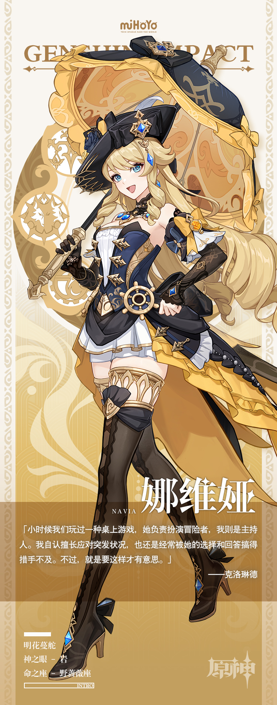

# 《飞翔的黄玫瑰》

从外表来看，娜维娅小姐无疑是一位完美的枫丹淑女。

她习惯穿着设计繁复的裙装，戴精致的礼帽，手腕上挂一柄缀着宝石与蝴蝶结的伞。

然后，奔走在枫丹廷的街头巷尾、秋分山的原野上，和灰河那些不知名的角落里。

拖在身后的裙摆和那柄比看上去要重上许多的伞从未影响过她的行动，她如一只灵巧的鸟，为那些陷入困境的人们带来刺玫会送出的好消息。

也许正是因此，娜维娅成为了知名记者夏洛蒂最喜欢取材的对象之一。

蒸汽鸟报社的展厅里就挂着一幅与她有关的画片，其名为《飞翔的黄玫瑰》。

当然，画片的展出征得了当事人的允许与大力支持，还请不必多虑。