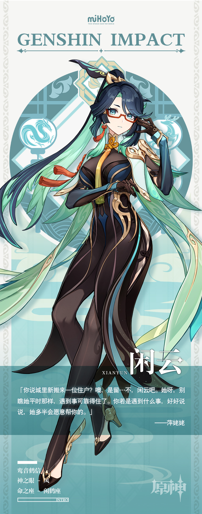

# 侠中影，云里客

谈及闲云，大伙儿有话要讲：那个盘发的高个女人，那个戴眼镜的手艺人，那个话很多的新邻居…百人百言，汇聚起来便是人们眼里的她：幽默，唠叨，热心，好相处。

闲云自己倒不觉得。她自认不善言辞，为人谦和，身有傲骨。除了精通机关术，擅长做各种小玩意之外，和别人口中的大不一样。

有人好奇心重，觉得闲云言行举止不似常人，认定她是一位女侠，四处打听她是否在江湖上大有作为，又是否另有雅号。

问往生堂客卿，客卿摆手：「闲云？不甚了解，听名字应该是个好人吧。」

问玉京台萍姥姥，姥姥点头：「闲…噢，闲云？遇见过。好人啊，认识了她呀，你这日子过起来可就安稳多喽。」

问甘雨，甘雨点头：「是位侠客。她不爱张扬，才隐姓埋名住在璃月港。」

问申鹤，申鹤沉思：「闲云，自然是高人了。千万不可得罪她。」

人们的猜测属实不假，闲云大有来头，只是知情者太少。若是换一个字，唤她留云，大家立刻便认识了，连连夸赞：说留云借风真君，谁不认得！侠肝义胆，玲珑心肠，值得结交。

问问闲云自己吧：「您是女侠？莫非…莫非还是个仙人？」

新住户正在研发她引以为傲的玲珑小汤煲，无暇辩解，只是坚称此乃无稽之谈，别打扰阿姨，阿姨在忙。

至于玲珑小汤煲是个什么，没人知道，仅仅听说比寻常汤锅更能提鲜吊味。玲珑小汤煲的问世将给璃月港美食界带来怎样的冲击，也没人知道。闲云说它厉害，它便厉害吧。