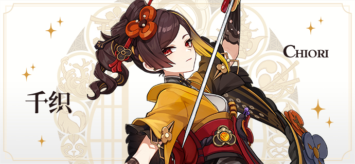

# 千红曙染，裁锦缀织

枫丹利奥奈区最繁华的街道上开着一家名为「千织屋」的服装店，看似门面不大，却时常有人在窗前驻足观望。据说其老板千织出身稻妻，作风亦如雷霆般不留情面。而那些偏不信邪要去干扰她做生意的人，结局也被所有人看在眼里。他们不仅尝到了败北的滋味，有的——生来头一回——还尝到了屁股摔到下水沟里的滋味。

到底有什么样的背景与来历，才能让这位异国服装设计师如此敢作敢为？枫丹廷记者们面面相觑，心生好奇。他们不断挖掘她的生平和逸闻，甚至不惜远渡稻妻，暗中走访她的亲友与曾经的裁缝老师…

我行我素，自小顽皮，从不对长辈使用敬语…评价似乎并不怎么正面。

唯独千织的父母露出欣慰的笑容，说她只是「想法独特」、「一心追求自己的理想」罢了。

「千织小姐，请问您是如何成功的呢？有什么做衣服的诀窍吗？」

彼处的千织正收起针线，冷眼瞥着「顾客」模样的记者。

「想怎么做就怎么做。还有…你到底买不买衣服？」