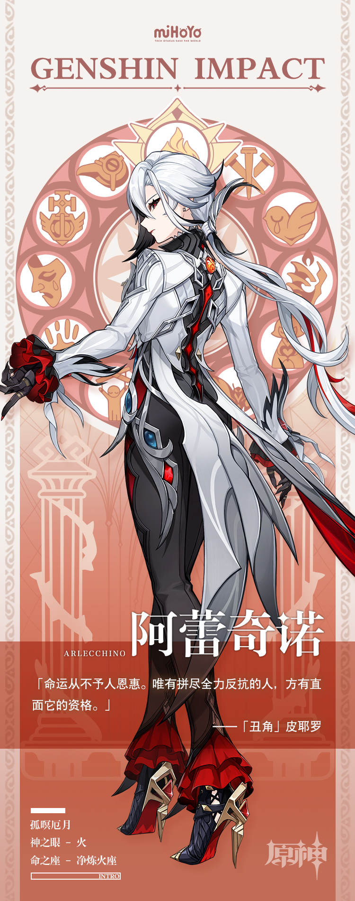

# 繁星晦暗，厄月孤存

时至今日，阿蕾奇诺仍然记得自己受封执行官的那个夜晚。

踏上阶梯，穿过长廊，窗外是一望无际的冰雪。

冷冽的风在她耳边呜咽，如同欢笑，如同告别——

阿蕾奇诺回过神，记忆中的幻听与现实里的聊天声重叠在一起。

小屋里的炉火烧得正旺，柔和的暖意充满整个房间。火光将孩子们的脸庞映得通红，他们的笑容纯真质朴，若是有不知情的旅人误入此处，大概会将他们视为平凡但幸福的一家吧。

阿蕾奇诺端起冒着热气的红茶，饮下一口。恰在此时钟声响起，刹那间所有的欢声笑语消失不见。火光摇曳，灯影幢幢，屋内的每个人都神色肃然。

阿蕾奇诺将杯子放回原处，站起身平静地点了几个名字：

「沙普洛，你跟林尼搭档，把情报带回来。福尔茨，你跟菲约尔在家留守…」

「是，『父亲』。」

回答她的是整齐划一的声音，没有丝毫拖泥带水。

不久后炉火熄灭，屋中不再有任何声响。只有月光穿过窗帘，照着逐渐冷下去的茶水。