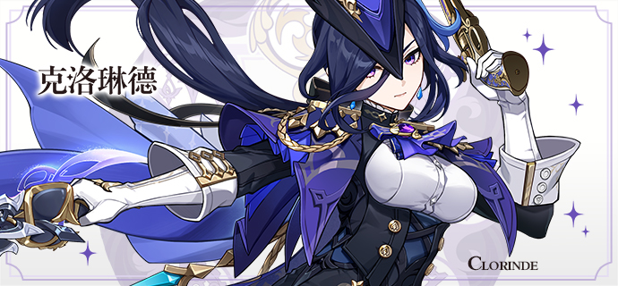
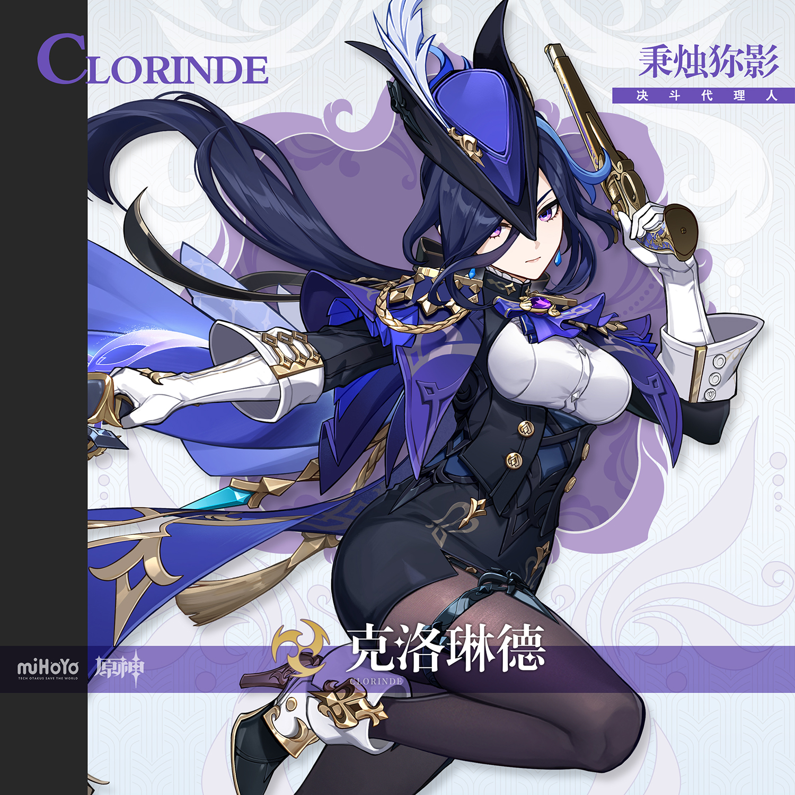
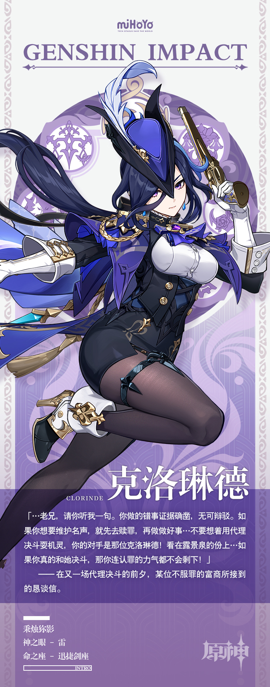

# 洞灭魔影，持护长夜

在热闹的枫丹廷中，几乎每天都产生着各类纠纷。

剧作家控诉一个狂热的读者正在模仿他进行写作，还起了一个和他差不多的笔名。报社都分不清他们究竟谁才是正牌了；商人则强调自己的某位同行一直在针对自己进行恶性竞争，不仅频繁调整定价，还把店面故意开在他对面…

普通的纠纷往往会被赶来的警备队员迅速调解开来，而少部分自诩聪明，实则心怀鬼胎的人，却想借着纠纷为自己打出名声，固执地想把事情闹上审判庭——如果能申请到代理决斗，那自然就能搏到更大的名声。

不过，如果某位好心的邻居开口说：「据我所知，最近『代理决斗』的决斗代理人是克洛琳德小姐，您…」

那么，这位聪明人会在刹那间失去所有凌人的气势，就像是一只被捏住脖子的紫金渔鸥一般，止住所有话语。

人人都知道这位「最强」决斗代理人的大名。

在克洛琳德的剑下，任何伪装成正义的卑劣言行，试图钻营的侥幸心机都会现出原形。在「代理决斗」中，她从无败绩。

「…咳，我觉着，倒也不必闹到如此地步。」

差点被自己的小聪明呛晕的聪明人灰溜溜转身离开。

如此，一场别有用心的纠纷悄然消弭。