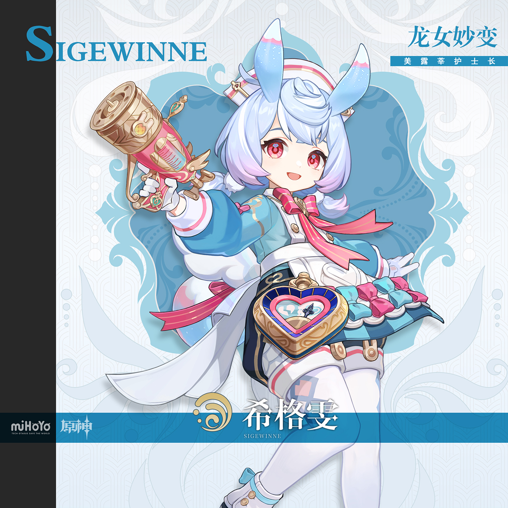
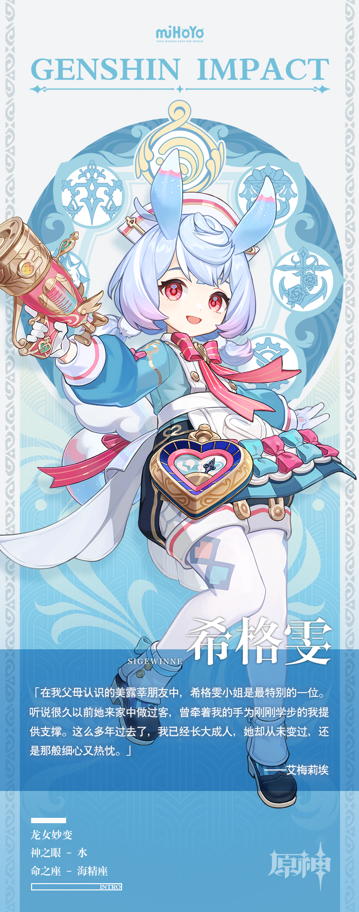

# 圣洁之灵，请听我愿

在太阳不照的梅洛彼得堡中，医务室是最为温暖的地方。

传闻管理着这间医务室的护士长也是其最初的建立者。数百年间，梅洛彼得堡几经易主，乱象频发，但生活在此的人却都不约而同地维持了某种默契，那就是绝不对医护人员出手。

原因很简单，能在这种地方长期停留、不辞辛苦治疗犯罪者的医生很少见。

而像希格雯一样温柔可爱、细心体贴的美露莘护士长，更是千载难逢。

曾有闹事受伤后被护士长救回一命的犯人，赞美希格雯小姐是上天派来为罪人们带来救赎的使节——简称「赎罪天使」——还妄图大肆传播此等称号。

「这实在是太夸张了。」护士长摇着头，双角也频频摆动。

「救你之前，我不会过问你犯下的错误；但你痊愈之后，还是要乖乖接受惩罚的哦，夸我也没用！」她叉起腰说道。