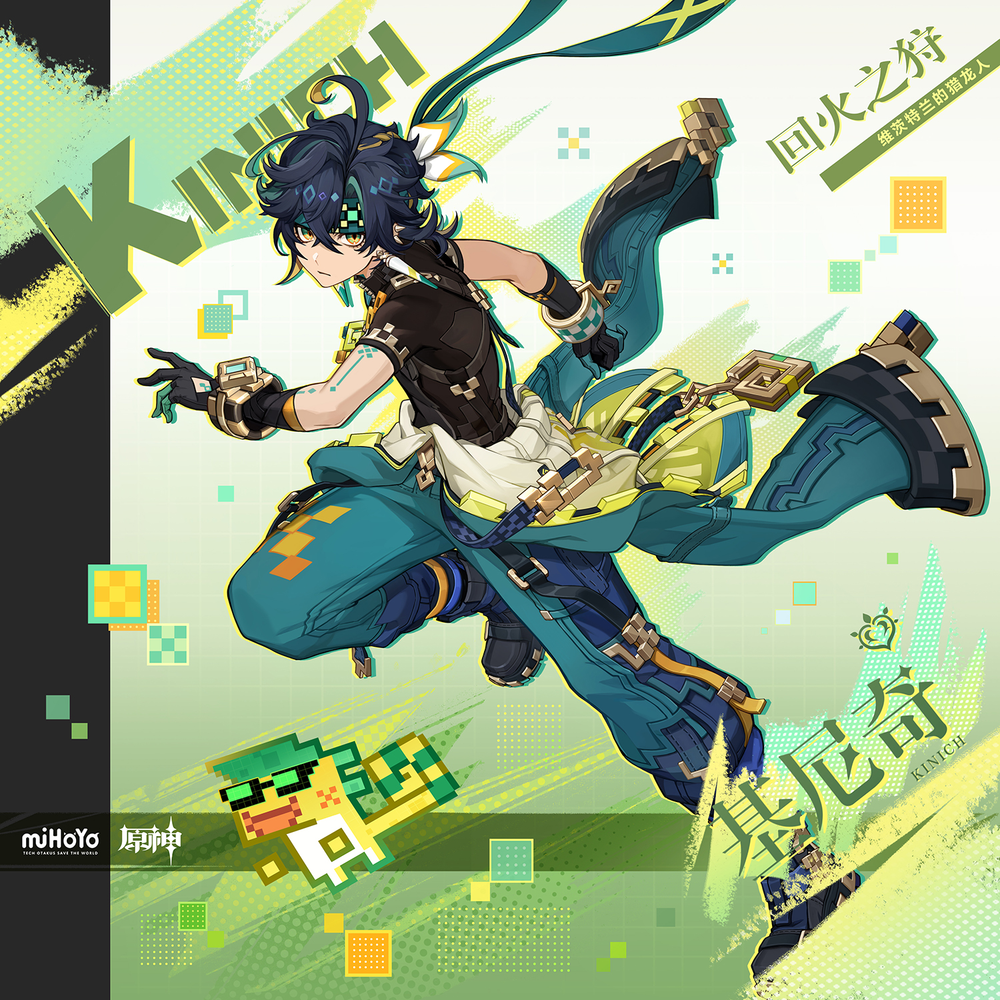
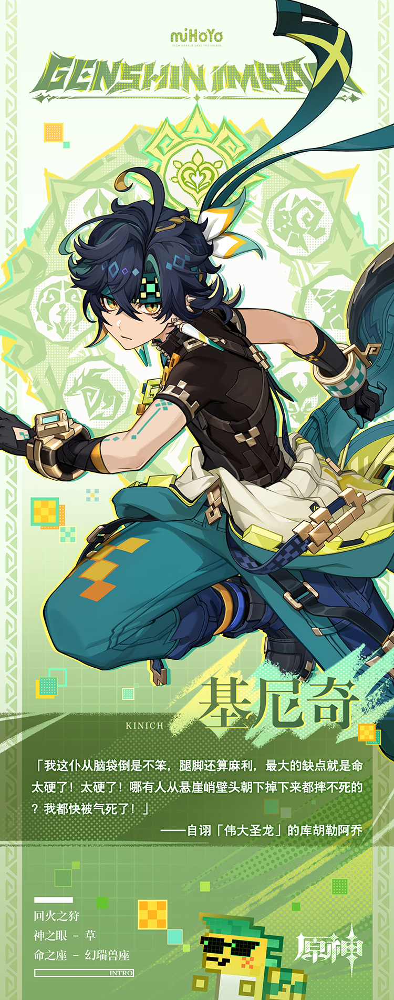

# 悬木游火，受任皆偿

「送信收个跑腿费也就算了，我从没听说过主持回火夜还要收费的，这还是我们的英雄吗？」

「你又不是第一天认识他。他活干得不是很漂亮吗？这就够了。」

在人与龙和洽共生的纳塔，猎龙人这一职业从诞生之初就无法获得所有人的理解。在英雄辈出的纳塔，为任务度量价格的做法更是颇受非议。

残酷、狠毒、冷血的杀手，现实、功利、全无英雄模样的继承者…人们将没有温度的关键词赋予从不反驳的少年。

但这有什么关系呢？

一切价码合适的委托都将以恰当的形式完成，一切蠕动或肆虐的污秽都将被送回夜神之国。

「回火」之名的持有者一旦钩紧目标，就再不回头。