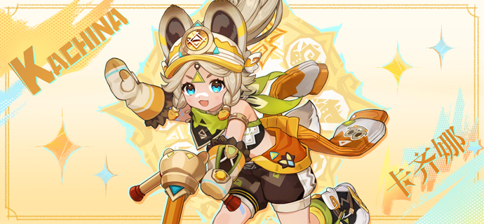
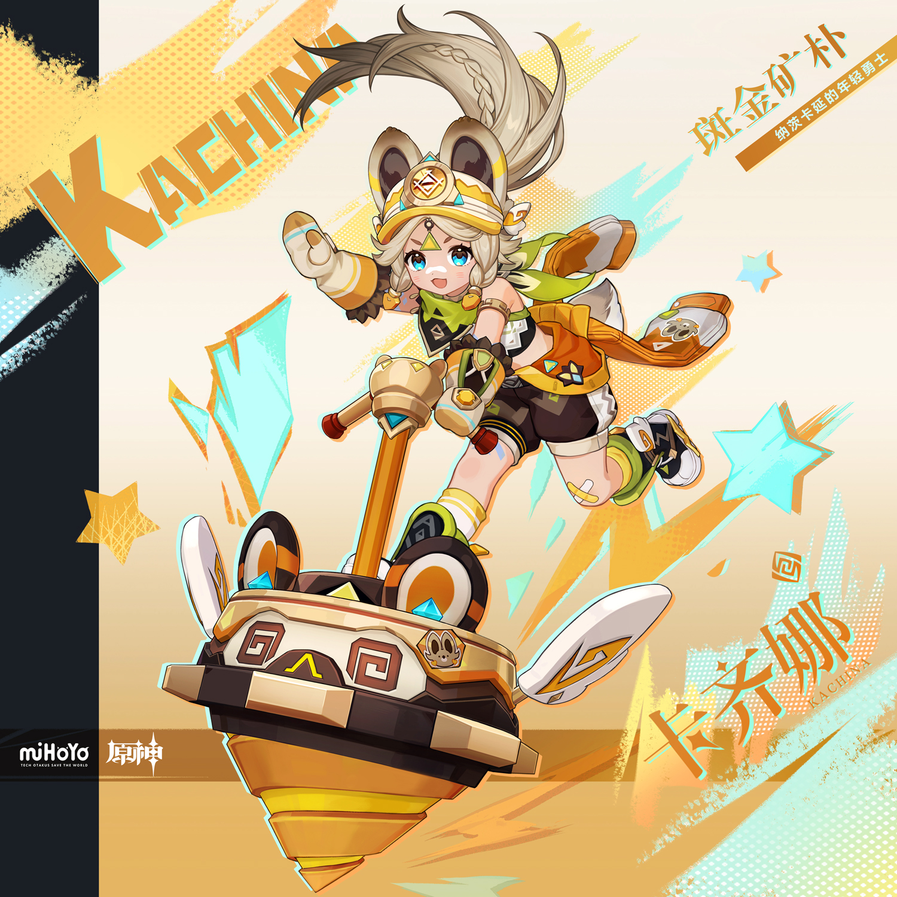
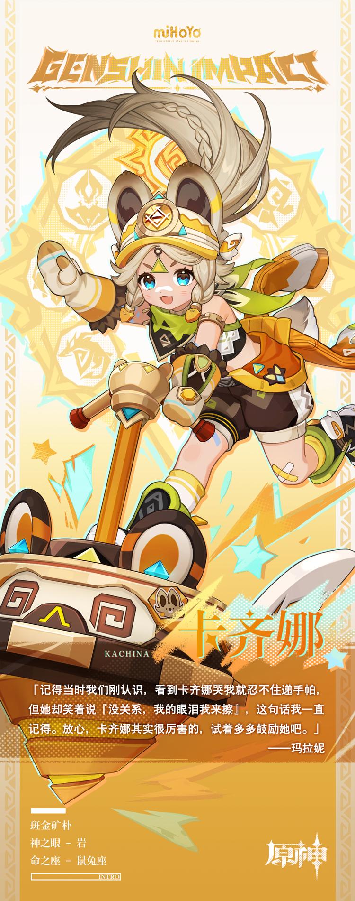

# 眼泪与勇气熔铸出的宝石

像「回声之子」中的其他孩子一样，憨态可掬的嵴锋龙、山脉深处挖出的闪亮宝石、长辈间口口相传的英雄故事陪伴卡齐娜成长。她熟悉山间道路、擅长寻觅深埋于地底的矿藏，闲暇时常常和其他孩子一起，跑去唱片艺人们灌制音乐的工作室，踩着节奏随性跳舞。磕碰总是难免的，卡齐娜也会因为疼痛而落泪，不过在其他孩子还没有从痛楚中缓过劲来的时候，她已经抹去眼泪，重新站了起来。

在大人们眼中，她当然是个好孩子，可卡齐娜不太明白这样的自己为什么会被誉为「乌沙博蒂」，她记得那流传已久的诗句——

「谁敢以骨为墙垣，屹立不倒，逼视太阳，谁就被托付给永恒。」

「恐惧应当恐惧我，因我身如烈火，注定熔蚀卑琐，铸为碑文。」

自己身上究竟有哪一部分契合了这伟大名字中的坚强之意呢？幼小的卡齐娜还不明白。不过既然得到此份殊荣，那么无论在「归火圣夜巡礼」中经历几次失败，卡齐娜都会努力振作。哪怕遭遇同伴排挤、非议，哪怕失落、自卑，许多负面情绪泥石流一样压向她，最终也会被她随眼泪一同抹去，「乌沙博蒂」的卡齐娜绝对不会被泪水打倒。