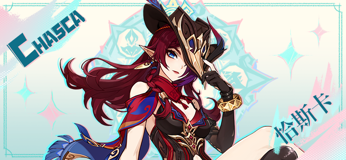
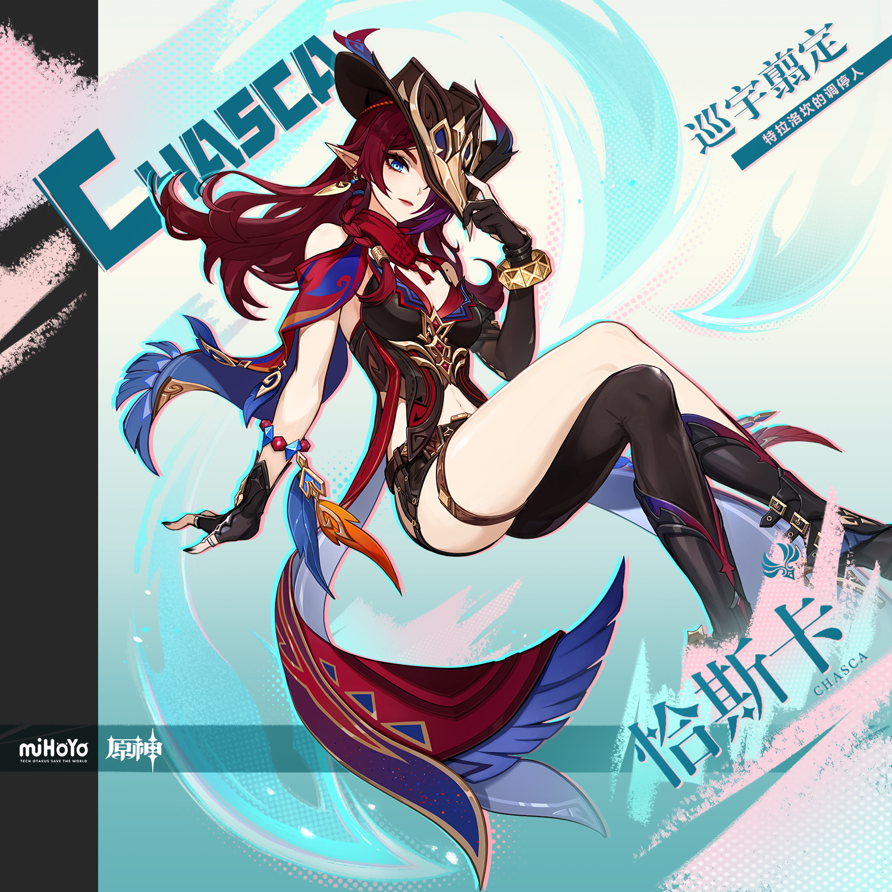

# 风花铿锵，飞羽凌空

「…这孩子已经没有救了…我当然也不能接受！可是…求求你了…放弃吧。」

这是恰斯卡降生以来，遇到的第一个「矛盾」。

「…这孩子到底是怎么回事？是被绒翼龙养大的？难怪性子那么野…」

这是恰斯卡回归花羽会后，遇到的无数个「矛盾」。

尽管孩提时期的记忆已经模糊，但恰斯卡依旧记得这些话语之下涌动的情绪：失望、痛苦、不甘、郁结…被无数情感纠缠，人们身陷「矛盾」之中。

但「矛盾」也会迎来解决，只是需要一点转机。

「——啁？」一只绒翼龙翱翔空中，偶然瞥见了地上嗷嗷待哺的「孩子」。

「下次至少先打声招呼吧！」一名少女翻遍群山，气鼓鼓地找到了离家出走的「姐姐」。

…也许很多「矛盾」，并没有人们想象得那么根深蒂固，难以「超越」？

整好行装，子弹上膛。已是「调停人」的恰斯卡推门而出，拥抱迎面扑来的晨风。

「这一次…该换我来解决矛盾了。」恰斯卡压低帽檐，轻笑自语。