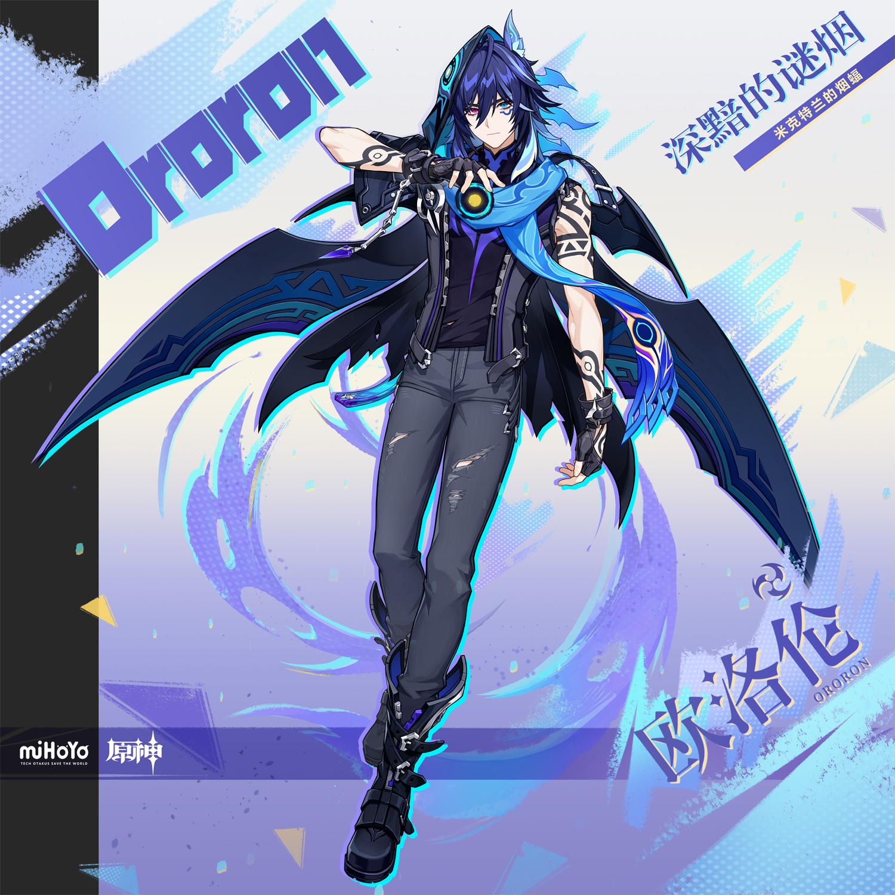

# 难辨难明之形色

某个炎热的午后，一位年轻人关上家门，转头对着院子里的菜苗道别。

「午安。我现在要出门一趟，希望回来后你们能变绿一点，加油。」

没过多久，他带了朋友回来，走过门口的大树时好心叮嘱对方。

「最近大松果的树根长得比较放肆，小心不要被绊倒。」

纳塔是片神奇的土地，从小在这长大的好医生伊法对欧洛伦的怪话已经见怪不怪。他记得这棵树曾被一只名叫小松果的绵驮兽撞过，这也许就是为什么欧洛伦会管它叫大松果。

它甚至不是松树——伊法这么想着，但没多问。

正如前言，纳塔是片神奇的土地。它包容了所有顺利成长，和长得没那么顺利的生灵。一切皆有其因，皆生其果，皆为其所用。残缺的、狡黠的、执拗的…他们都将燃烧，汇入斑斓的灵火。