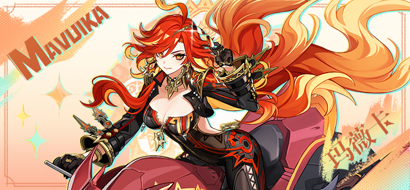
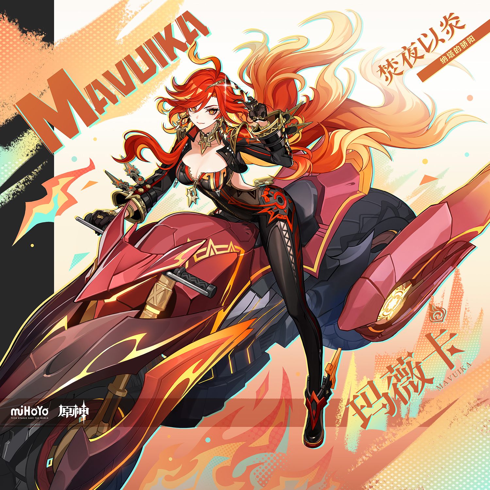
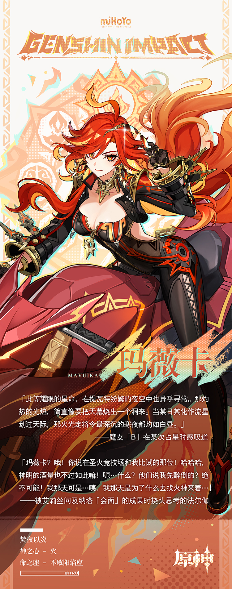

# 至明、至炽、至烈的再临之火

要如何介绍她？「基扬戈兹」的玛薇卡，我们纳塔人当之无愧的领袖。

织卷与长诗将此最为传奇的古名事迹一一记载。伟人层见叠出，荣耀代代相传，她从未辜负如此厚重的期望。

肩负「最强战士」之名，她尊重一切或强大或弱小的生命，一视同仁。

人们也因此爱戴她、歌颂她，发自内心地追随她。

每一次，当她为「归火圣夜巡礼」致辞，她的发丝随圣火飘动，威严的声音在我们耳边回荡。

她将鼓舞的目光投向每一位战士，每一只龙。她呼唤每一簇纳塔的火，聚燃为驱退黑暗的光亮。

当我们搀扶着漫行在无边长夜，拭干眼角泪水，艰难地抬起头——

只看见那一抹坚毅不改的红，如旭日东升。

她牺牲了什么？她舍弃了什么？她凭借何等意志一路行至今天？

我们无不相信，她将引领纳塔走向又一场胜利。

我们的太阳永燃不息。