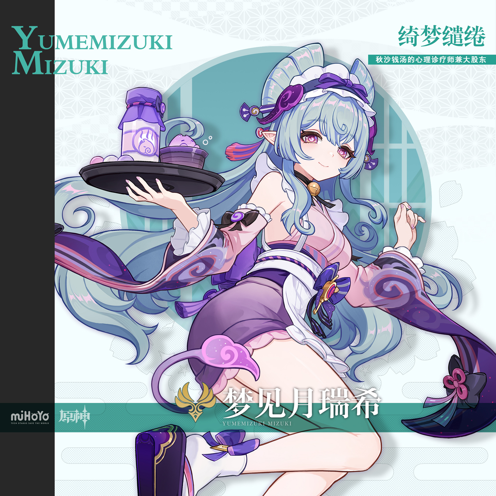
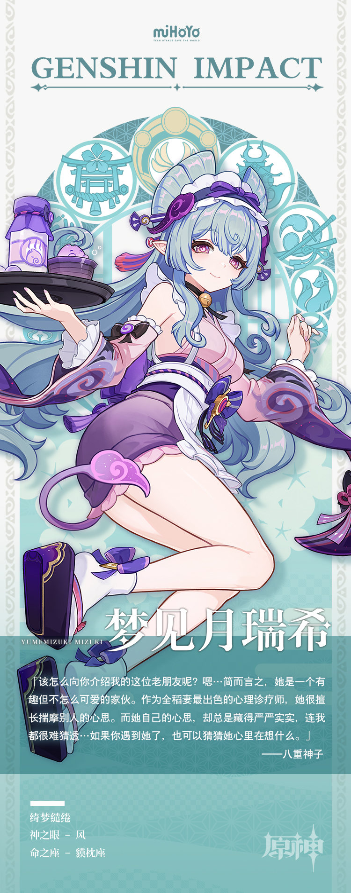

# 愁云拂散，梦间月明

稻妻有一个古老的传闻，运气好的话，人们在昏昏欲睡时能看到一种名为食梦貘的妖怪。这种妖怪可以潜入你的梦境，吃掉困扰你的噩梦。

时过境迁，这种一直活跃在传闻中的妖怪也开始尝试融入人类社会。随着那家名为「秋沙钱汤」的店在获得投资后重新开业，一众化形为人类少女的食梦貘开始以心理诊疗师的身份活跃在人们的视野中。

而其中最出色的那位心理诊疗师，当非梦见月瑞希莫属。再忧愁的客人，也能在接受她的诊疗后重拾快乐。短短数月的营业后，她在客人那里留下的口碑便成为了秋沙钱汤的商业护城河。

人们猜测这种诊疗效果与食梦貘一族吞食噩梦的能力有关，而梦见月瑞希对此总是笑而不语。只有极少数人才能察觉到，在这种笑容深处，还藏着一丝莫名的疲惫…