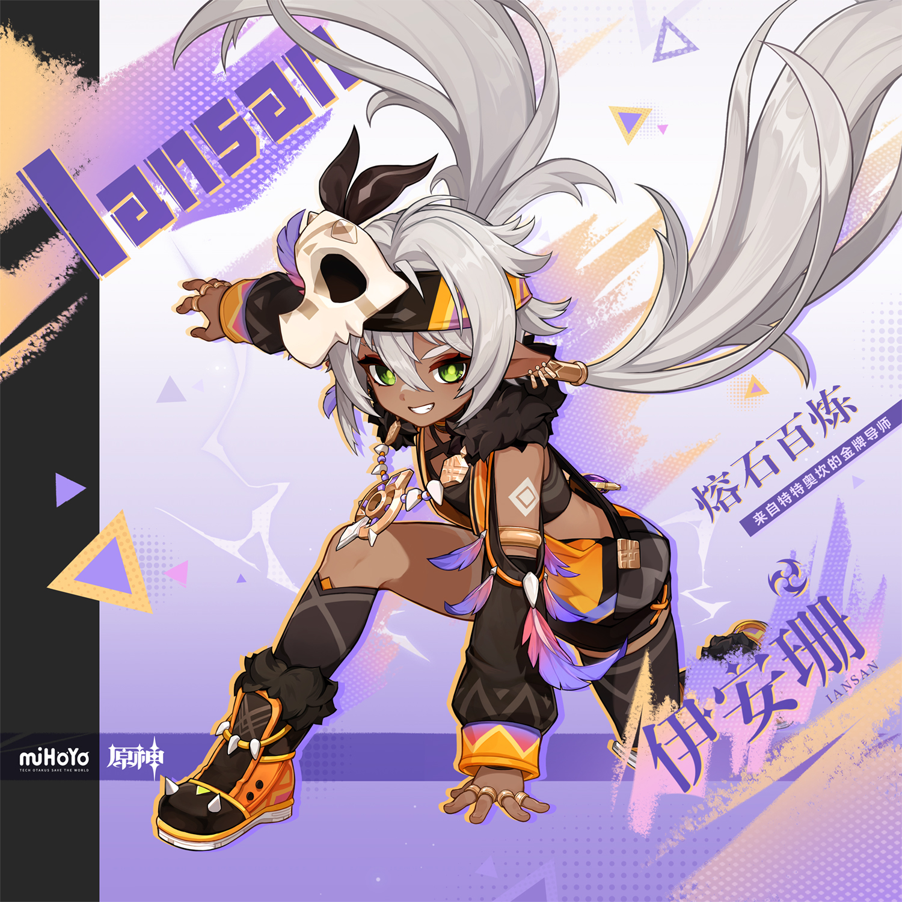
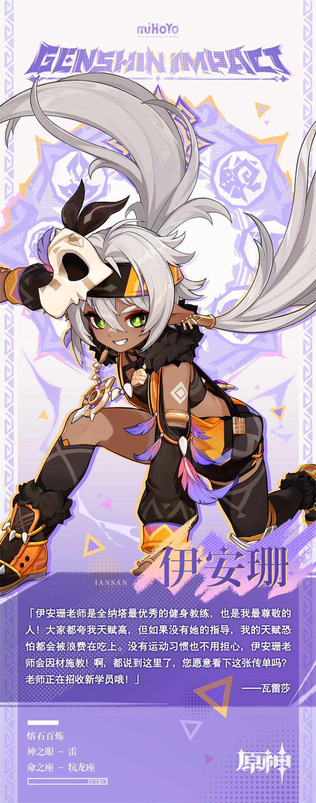

# 早睡早起，低糖低盐。

「你渴望突破自我吗？你渴望获得力量吗？」

「欢迎前往沃陆之邦参加归火圣夜巡礼优胜者培训班，名教练执导，助你摆脱孱弱的自我！」

许多初次来到纳塔的人都收到过这样的传单，而沃陆之邦的健身习俗声名远扬，也确实吸引了不少好奇的人前去报名。不过，但他们亲眼看到传单中提到的「名教练」时，往往会立刻认为这是一个骗局，并要求退出。

——伊安珊对此也很无奈，毕竟她那孩童般的体格与「强壮」、「力量」都不沾边，很难让人想象出她能够在「摆脱孱弱的自我」这一点上提供指导。

每当遇到这种情况，伊安珊都会邀请来客任选一个健身项目与她进行比试。而感受到被轻视的来客往往会接受这种比试，把被欺骗的怒火释放到健身器材上。

然后，在来客已经筋疲力尽时，伊安珊还能把他丢到地上的器材也拿起来，再多做十几组标准动作。

「到底是怎么做到的？元素力？神明的祝福？」

「不，是规划运动时间，控制热量摄入，补充营养物质。」

经历过这种插曲后，虽然来客大多还是对伊安珊的话持怀疑态度，但他们总算愿意报名了。