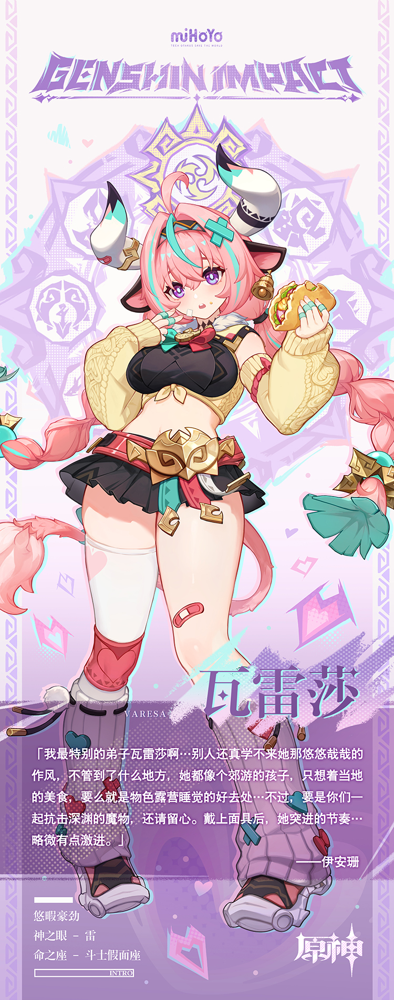

# 谨守恬安，豪勇锐进。

谈及「沃陆之邦」的子民，纳塔人的第一反应是赞扬该部族的「全民健硕」，随后，记忆中便会泛起果蔬的清香与甜蜜。力量与丰沃是这个部族永远的名片，而名片上尤为亮眼的花纹，便来自「瓦雷莎家的果园」——

伴随着一声吆喝：「瓦雷莎家的果蔬到货啦」，从最东端的「回声之子」到最北端的「花羽会」，每个部族的男女老少都能在接下来的几天内尽情享用健康天然而美味的作物。水果酣甜得令人迷醉，蔬菜的口感则像是雨后放晴的草原。久而久之，人们远远望见瓦雷莎的身影，便知道自己有了口福，开怀大笑起来…

而在孩子们的传说中，恶人与魔物出没之时，某位「面具英雄」便会裹着雷光降下，以三倍于突角龙般狂烈的冲撞，还有豪放如火山坠石的踢击，将坏家伙们统统打飞！这位英雄使出绝招时的口号成了孩子们之中的人气台词，而她离去之时的迅猛之势，更是被看成「英雄速度」的标杆…

细心之人稍加研究就会发现，传说中「面具英雄」遂行正义的区域，恰恰与「沃陆之邦」的货运道路高度重合。

出于责任，巡逻队的成员们找到同僚瓦雷莎，询问她是否见过相似人物时，瓦雷莎茫然挠头：

「听起来，说的好像就是我？」

在成员们的一致点头下，后知后觉的瓦雷莎突然有些害羞，用力摇了摇头：

「下次，我要再努力点，在坏东西被大家看到之前就打跑它们！这次…我先去填饱肚子再说！」