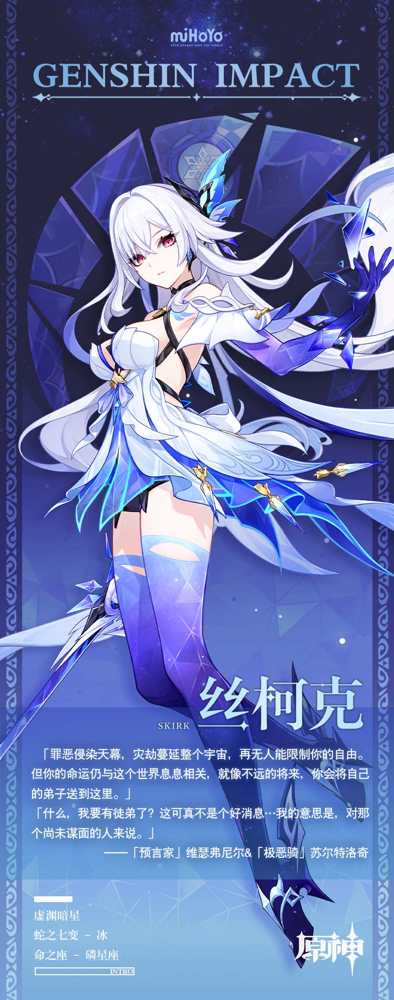

# 星海默然，覆灭无声

上，是夜幕的群星。

下，是地底的深渊。

无人知晓星空之外是什么样子，正如无人知晓深渊中到底有什么存在。

就像古老的坎瑞亚留下的那句谶言：

「我们走向宇宙，或者下到深渊。」

「并没有差别，因为都是未知的漆黑。」

在那地下的文明崩塌之后，在某个已经无人记得的焦土——

藐视命运的人曾从命运的手中带走一名少女。

长大后的少女也救过另一个被命运纠缠的小孩。

倘若一切都能以温情来衡量，倘若故事都能以圆满做收场…

只可惜前路渺茫，同样是未知的景象。