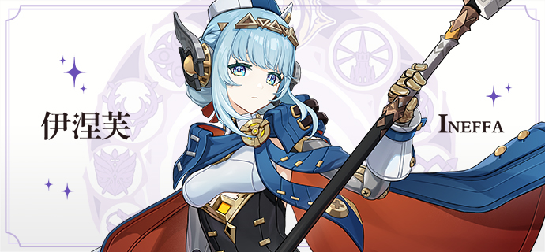
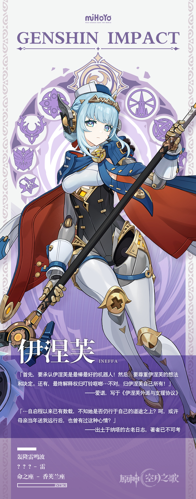

# 白铁锻身，赤心铸魂

人类试图以机关与齿轮仿造生命的运转，在提瓦特诸国的历史上数见不鲜。

坎瑞亚以钢铁铸就的巨人开辟土地，「奇械公」以发条驱动的机关启迪时代。

或许在一些狂人眼中，人类也不过是以肌腱与骨架构建的机械？

若将视线投向人类以外的造主，若将分野划至机械之外的造物。

魔神步入胎海，罪人投入深渊。古老的龙王在燃素上刻写意识与灵魂。

或为怜爱，或为野心，或为永恒的统治，或为反抗命运的愿望。

……

与这些无上的智慧与伟力相比，这座工坊只是一个有点孤独的孩子，为自己拼凑的乐园。

与这些宏大的命运与蓝图相比，伊涅芙在受造之时，并未被赋予如此崇高的期待。

——至少在这一次重启之际，她被赋予的使命，仅仅只是「陪伴」而已。