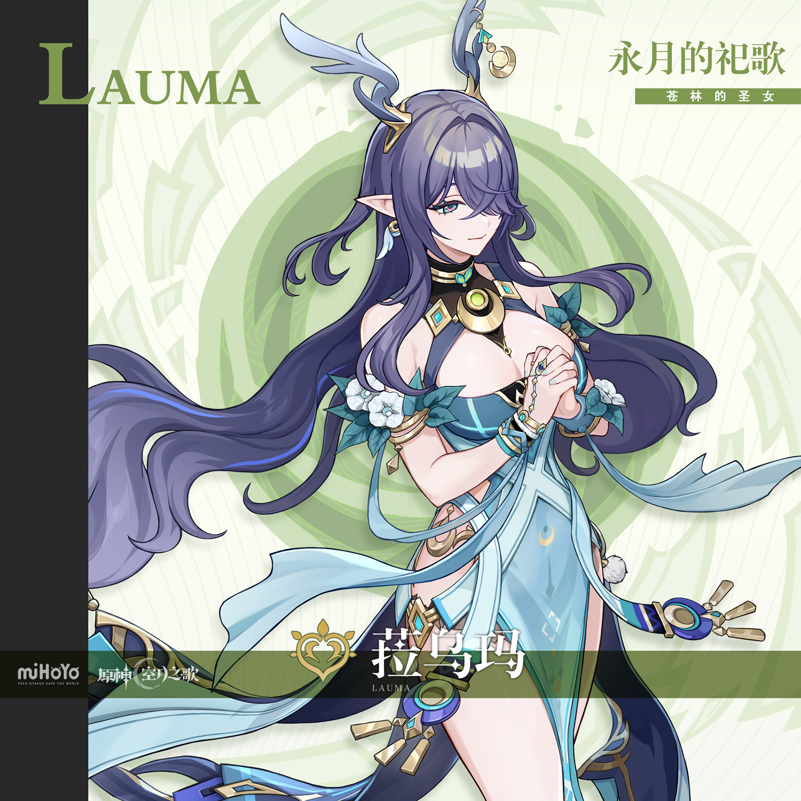
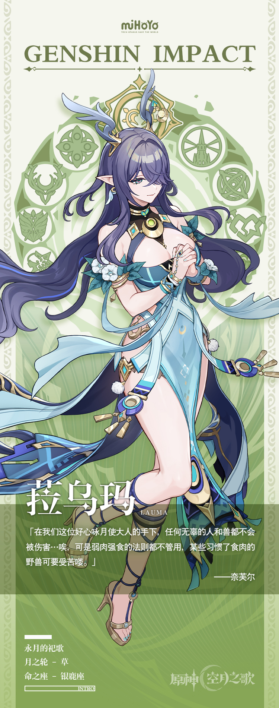

# 镜中有月，月碎水中

作为挪德卡莱所在之地的原住民，在如今的事态下，「霜月之子」反而显得格格不入。

他们过于古老，过于刻板，信仰着一位自己也没见过的神明。

他们相信苍林的树影是他们庇护所，相信满月的辉光将驱散所有的伤病。

他们向月亮祈祷，问霜月的女神啊，您将何时回应我们的愿望？

得不到回答，他们便又问，咏月使大人啊，月神将何时回应我们的愿望？

于是菈乌玛从树影中走出，走到月光之下。

于是教众们朝着她光辉的角冠与银血的图腾行礼，于是她成为了那位消失的神明的代理。
