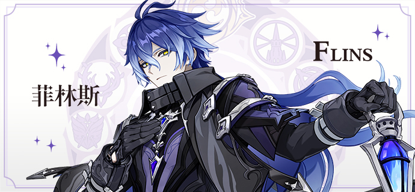
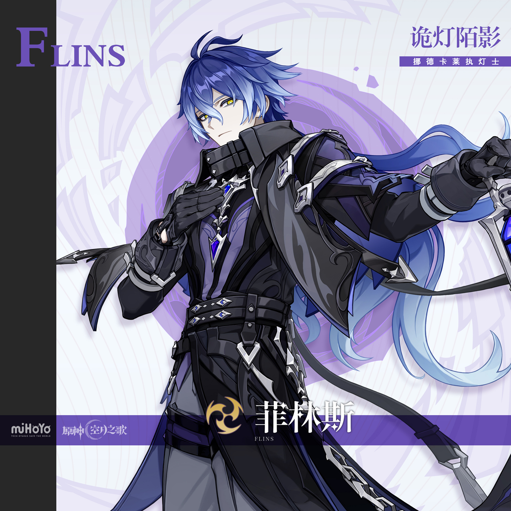
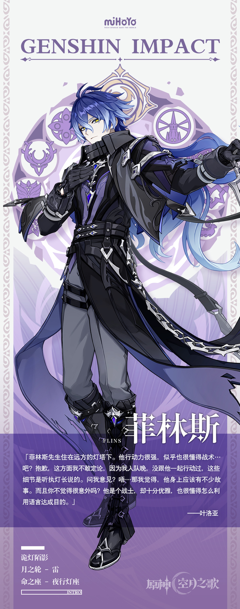

# 墓园灯火，引向深邃之暗

每到收获季，无论多让人陌生的来客都可能出现在聚会上。夕阳下，市集里就上演着如此一幕：那位绅士也到来了，被好奇的居民们邀请一同聊天。

他如此介绍自己：菲林斯，隶属于「执灯人」的一名战士，获得过民众自发送上的功勋章，用以表彰他所属的分队击退了深渊魔物。事件距今有些年头，尽管当时没有任何人站出来组织，人们也依然心有灵犀地选择用这种方式表达感谢。勋章很沉，放在一个古旧的盒子里送到他手上。

考虑到那次行动的伤亡，菲林斯认为，再来十个勋章也很难说值得。分队曾有七八个人，现在却只剩他独自留在灯塔一带看守墓园。

人群短暂地沉默了一会儿。他们联想到许多：狂猎、魔物…以及其他令人沉痛的往事。因为悲伤，他们无言以对。而另一些人，他们或许有许多问题，即便提问，菲林斯看上去也未必会回答。他半低着头的样子一看就是在缅怀过去。

相较其他执灯士，菲林斯的谈吐显得更优雅些。他不爱回答自己从哪里来、家中还有没有兄弟姐妹之类问题，更倾向于讲些遥远的事。他能将事情说得恰到好处，就像与人们对谈时那样，没有冗余，一切过往在他口中仅仅呈现为：真是件令人难忘的往事。

考虑到绝大多数听众并未经历过太多，人们对许多事的好奇不过是听听就好。菲林斯的行为，刚好符合这类需要——你无法否认，他挑选的，刚好都是最适合在人群中讲述的。
