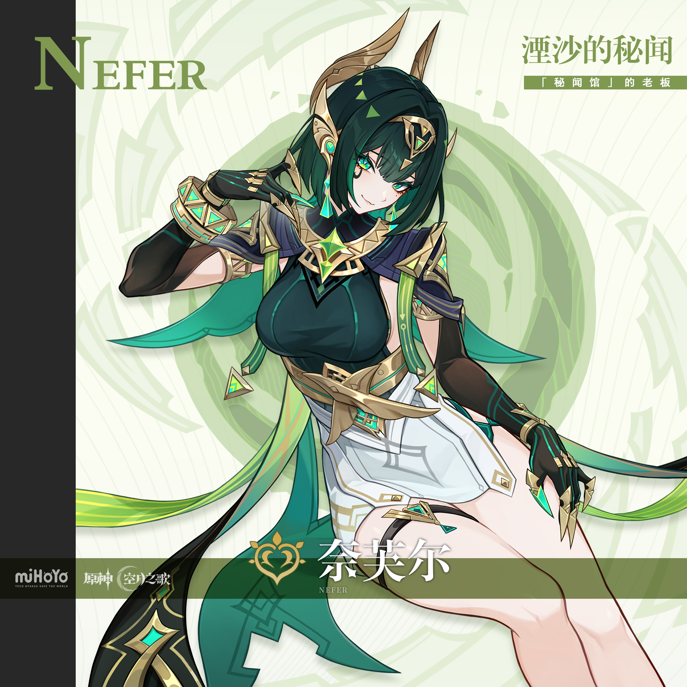
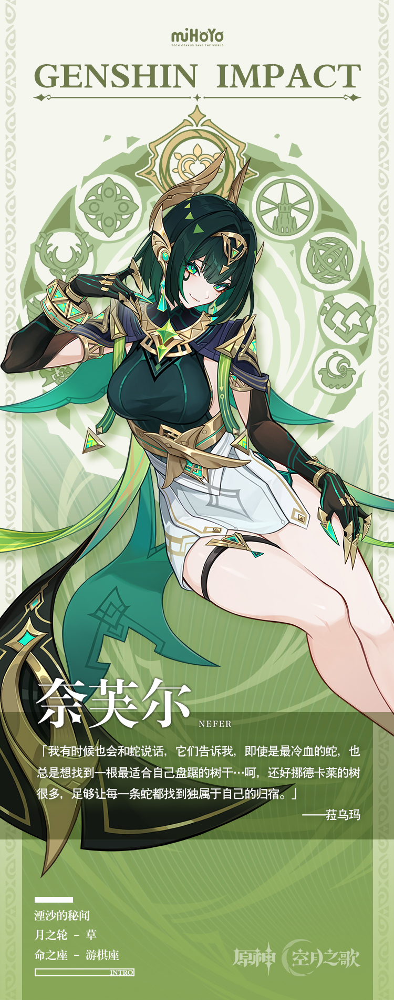

# 秘闻求解，索见诸心。

凭借着迅猛的执行速度，相对来说还算便宜——如果是雅珂达值班还能砍价——的委托价钱，「秘闻馆」在那夏镇的居民之中，有着良好的口碑。

无论是找猫还是找人，寻物还是寻踪，抓犯人还是抓负心人，只要接下了委托，「秘闻馆」一定能将事情办得漂漂亮亮的。

虽然「秘闻馆」的职能和相隔不远的冒险家协会好像有些相似，但挪德卡莱冒险家协会的会长好像早已与奈芙尔老板达成了共识，甚至已经在合作了。

细致想来，和「秘闻馆」达成合作，融洽共存的组织，好像还不止冒险家协会这一个，似乎大家都早早认可了「秘闻馆」的实力，愿意与之携手并进。

居民们对此倒是不以为然，毕竟在他们看来，能和神通广大的奈芙尔老板合作，绝对是一件幸运的好事，而那些组织的老板们都是聪明人，对这种好事肯定求之不得啊。

人们如此随意闲谈，打发着无聊的时光，名叫阿舍鲁的小猫悄悄地从他们身后走过。

它的嘴里咬着一封奈芙尔老板的亲笔信。

这封信的收件人，是一位不那么聪明的人。