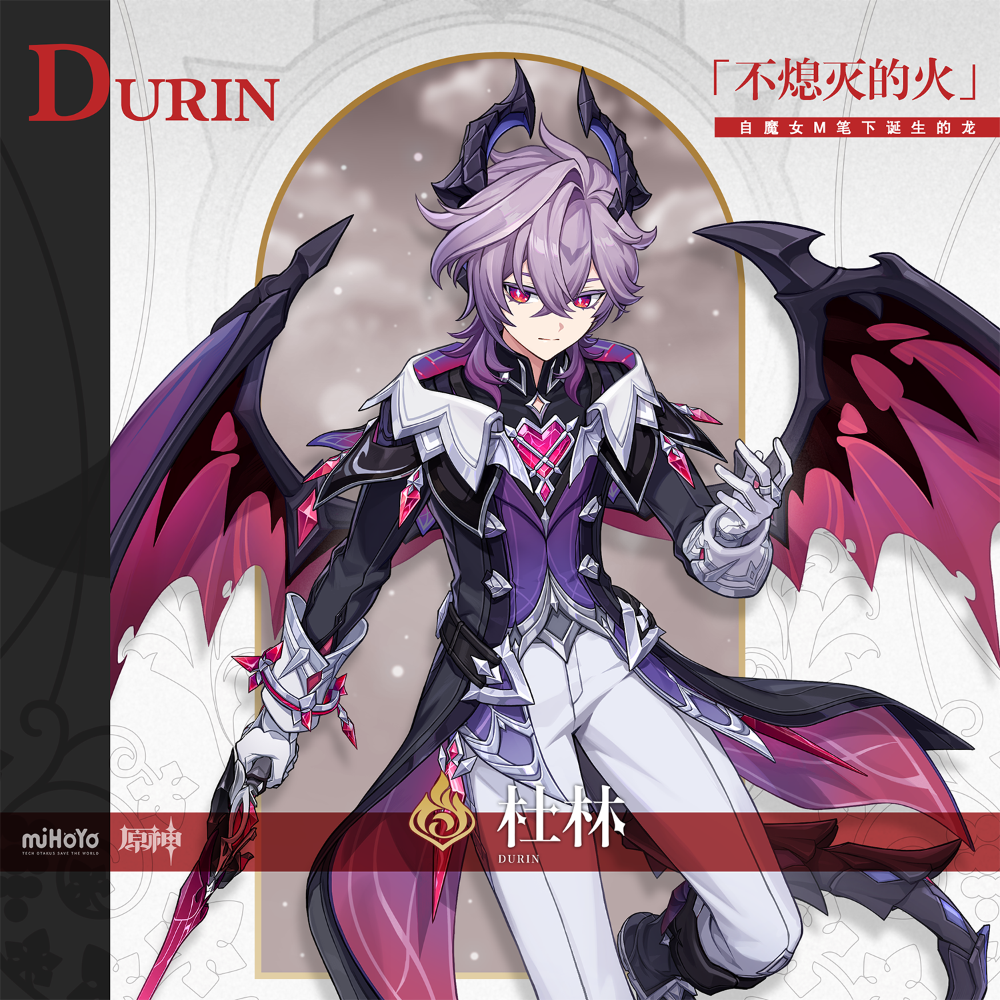
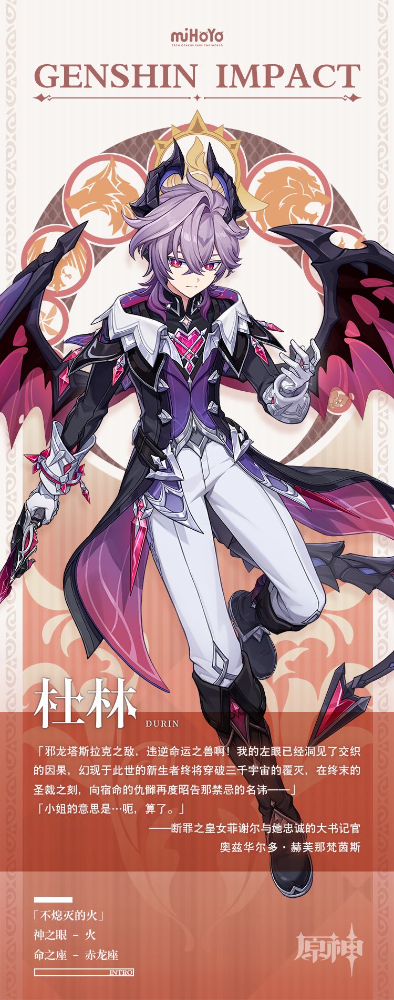

# 启自笔下，翱于星间。

在以往的蒙德城，当外地人问起「杜林的故事」，这里的居民大多会开始向他讲述一场过往的惨剧——那条名为杜林的恶龙裹挟着魔物袭来，在天空中与特瓦林厮杀，为蒙德带来了数不清的灾难，最终陨落在雪山。

而就在不久前，当外地人再次问起「杜林的故事」，得到的答案却不尽相同。有的居民会继续向他讲述那场发生在雪山的惨剧，有的居民则会提到一名头上长角的少年，并讲起他在酒馆出丑，以及和可莉一起被琴团长责罚的趣事。

「难道杜林的故事有了新的版本？」

带着这样的疑惑，有些外地人会找到蒙德城最会讲故事的那位吟游诗人，向他寻求答案。

而那位吟游诗人则会轻抚琴弦，眺望远方的天空。

「不，还是把它当成一个全新的故事吧，一个更美好的故事。」