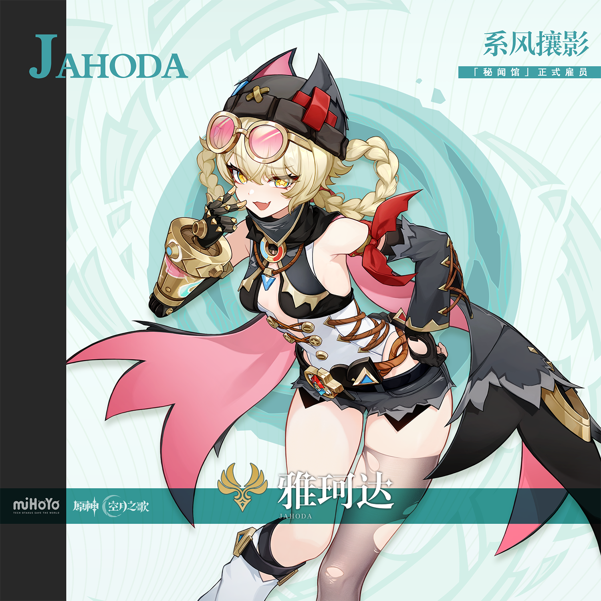
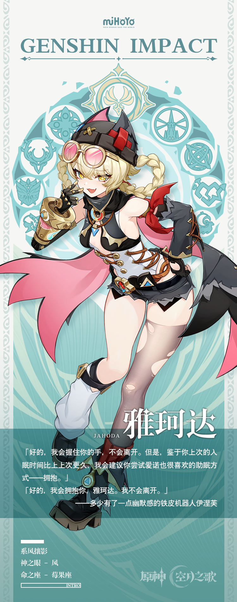

# 千虑秘闻，亦有一得。

在日复一日的跌跌撞撞和大呼小叫中，那夏镇的居民们早已熟识了那位「秘闻馆」的唯一正式员工雅珂达小姐。

有时候，她会趾高气昂地从「秘闻馆」里跳出来，一路小跑着给自己买一份超大号糖雕，有时候，她会气急败坏地在屋顶上狂奔，捉拿某一位骗了自己的委托人，还有的时候，她会垂头丧气地坐在「秘闻馆」门口，任凭阿舍鲁玩自己松散的头发…

有许多人问过那位奈芙尔老板，那夏镇那么多奇人异士，为什么只雇这么一位普普通通——还有些笨手笨脚——的小姑娘。

奈芙尔老板的回答，却总是：

「无论如何，就当做相信我的眼光吧。」

而在某些倒霉透顶的日子里，雅珂达也会耷拉着脑袋，无力地询问自己的老板：

「奈姐…你不会哪天突然开除我吧…」

「怎么会，要是你走了，谁给阿舍鲁添水加食呢？」

「欸？就这样？可是…」

「哇！笨蛋阿舍鲁你给我下来！我刚绑好的辫子啊！」

「喵喵，喵——」

秘闻馆的老板托着下巴，看着一人一猫打闹着。

奈芙尔知道，雅珂达会继续成长，直到她避开所有的险滩暗礁，成为自己人生的掌舵之人。

到那个时候，这个一无所有，孤身一人的孩子，就不得不开始思考，自己究竟要驶向何方。

对奈芙尔来说，这是一个足够有趣的「问题」。

对雅珂达来说，这是一个足够重要的「答案」。