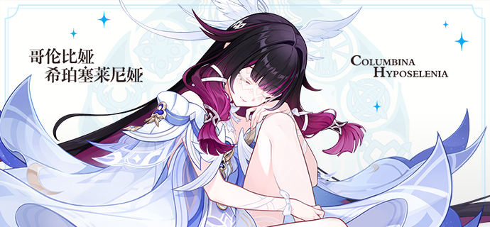
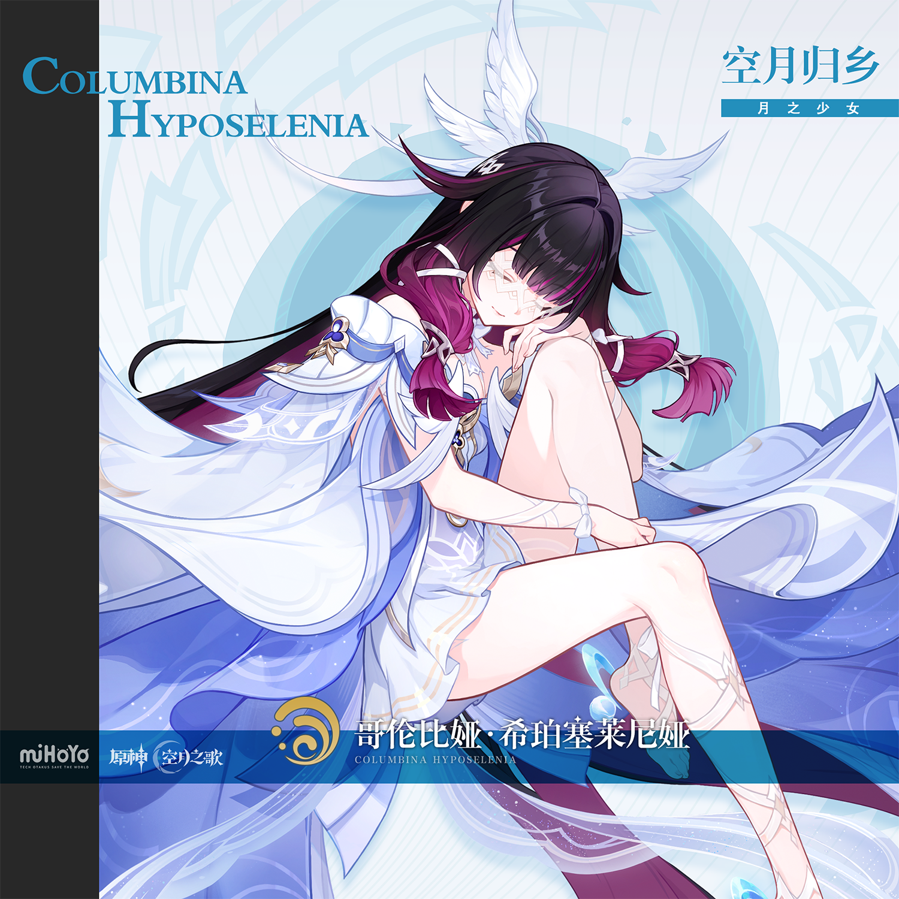
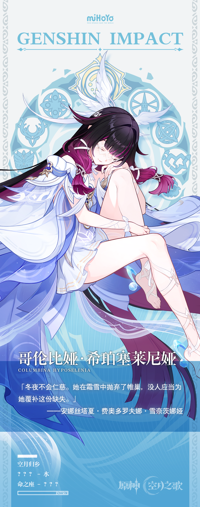

# 月下白鸽，何以为家？

对哥伦比娅来说，这颗星球不是一个好的母亲。

她给了哥伦比娅一个足够特殊的身份，将自己诞下，但这仿佛已将她的爱全部耗尽了。往后的日子里，母亲以冰冷的沉默拒绝了伸出双臂的自己。哥伦比娅只能闭着眼，在墙壁与墙壁之间摸索着前进。

困住她的迷宫是一个圆环，一座螺旋向上的高塔。哥伦比娅轻声哼唱记忆里的旋律，那是她与「母亲」唯一的联系。她赤足走过霜月之坊和格鲁波夫堡，再度回到银月之庭，墙壁上依旧泛有她自己的回声。

但与从前不同，如今的她在朋友们的帮助下找到了属于自己的名字。她有所望，也有所求。

她想回家，她已经来到塔顶之上，那个写有答案的月亮离她近在抬手之遥。

她伸出双臂，却像月亮坠落在水里。