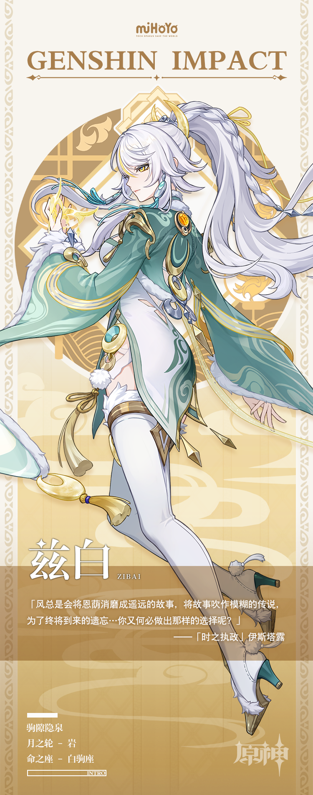

# 天地一瞬，野马尘埃

璃月民间向来不乏仙人逸闻流传。

如《清斋广录》中布雨驱旱的云霓闲仙，如《护法仙众夜叉录》中祓除疫疠的金翅鹏王。

他们都是曾护佑四方太平的大威能者，受人瞻仰。

还有这么一位白马仙人，她的痕迹，同样留存于各种书籍与民话中。

有人说她曾化形为白马，在魔神相战时助岩王取得尘世大权。

有人说她有一双琥珀金瞳，能够看穿无穷远的时间荒原。

有人说她其实一直身居月上，正聆听凡夫心愿，守望灯火人间。

可众说纷纭下，始终却没人能将她的形象说个明白，描个真切。

无论茶余饭后的闲谈，或是笔墨纸砚间的论证，皆为管中窥豹，只可得见一斑。

但有道是，似那吉光遗片羽，犹如飞鸿踏雪泥。

她的过去，终是在尘世留下了痕迹。她的故事，也将迎来重现人间的这一天。