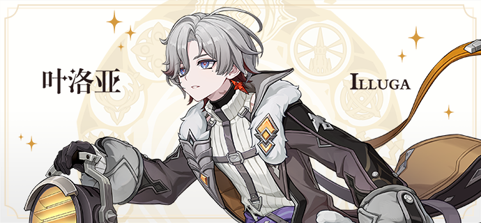
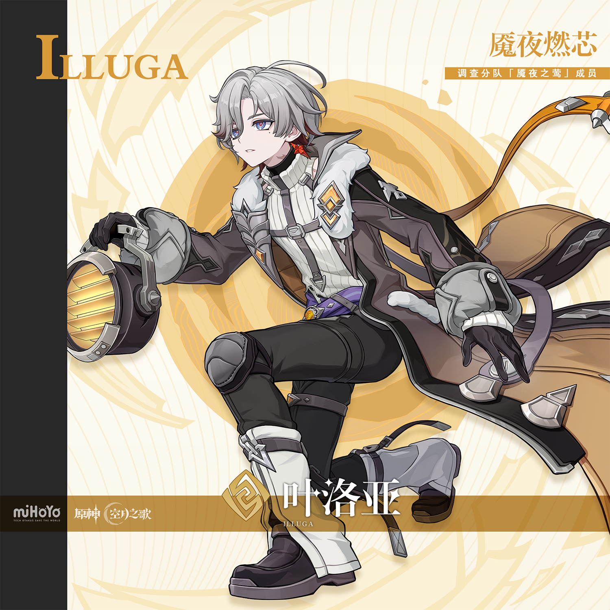
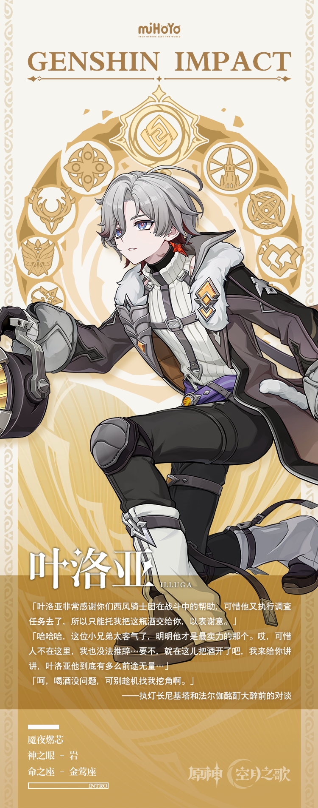

# 普照魇夜，方启明昼

对每位新加入执灯人的成员而言，最幸运的事莫过于拥有像叶洛亚这样的领队。虽说执灯人每天都在目睹狂猎肆虐后留下的惨剧，居所的气氛难免有些沉重与压抑，但叶洛亚好像都能保持积极，不仅能妥善处理好各项事务，还能为队友提供无微不至的帮助。与他同行之时，仿佛手中的提灯都会更暖几分。

也有人会疑惑，这样的人为什么没有选择去做后勤，而是执着地想要前往危险的前线。如果没有坚定的意志与强烈的驱动力，那些乐观的笑容终有一日会被紫黑色的绝望淹没。然而，只要听到叶洛亚坚定地诵读执灯人的誓言，这种疑惑就会从人们的心中消解——毋庸置疑，在他温润的外表之下，也有一团炽热的火在熊熊燃烧。

何谓执灯人的理想与信念？这是新人最常问的问题，也是对于每位执灯人，答案都截然不同的问题。但这种回答总有共性——守护与拯救，坚毅与义无反顾，它们都会描述某个美好结局，或是某个崇高愿景，都无比宏大。

但叶洛亚除了消灭狂猎之外没有什么想要的，因为他能意识到，现如今的皮拉米达城就是那种理想的具象化。

只有经历过魇夜之人，才能理解明昼的可贵，他想守护的东西简简单单，就是「现在」。