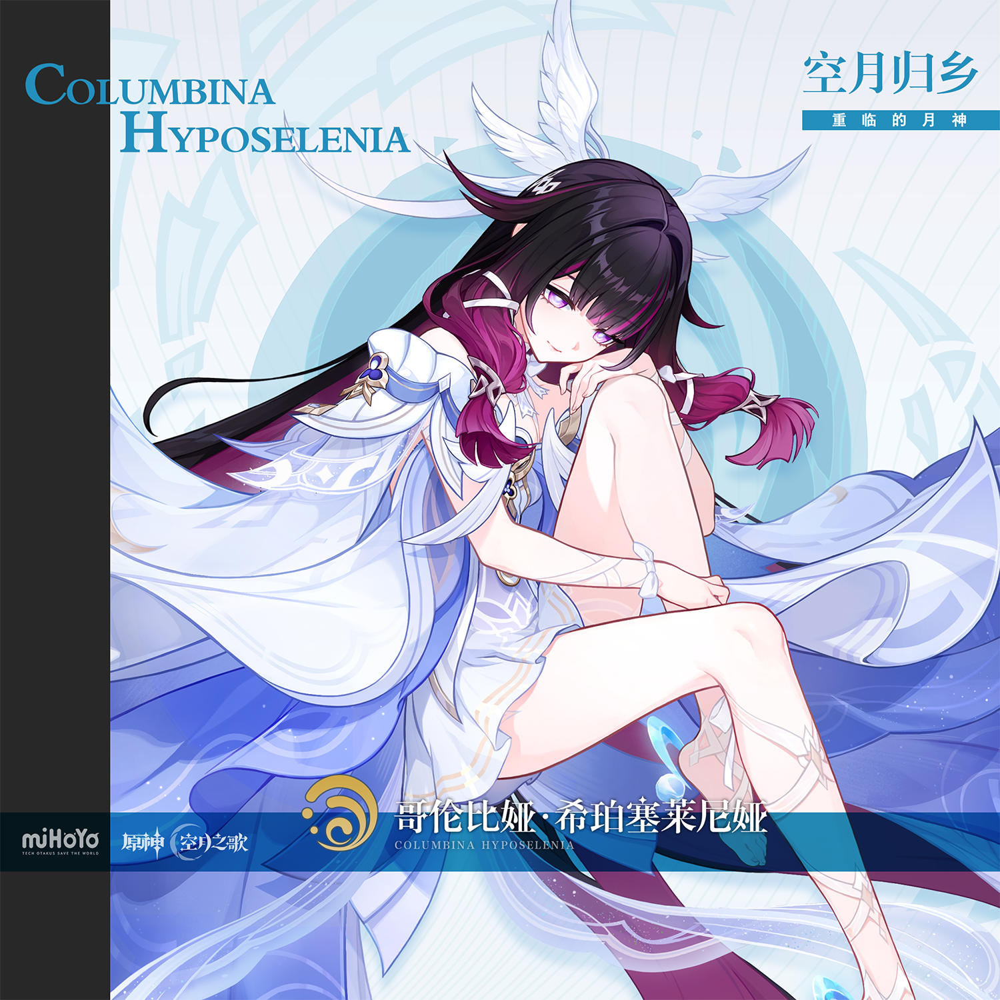
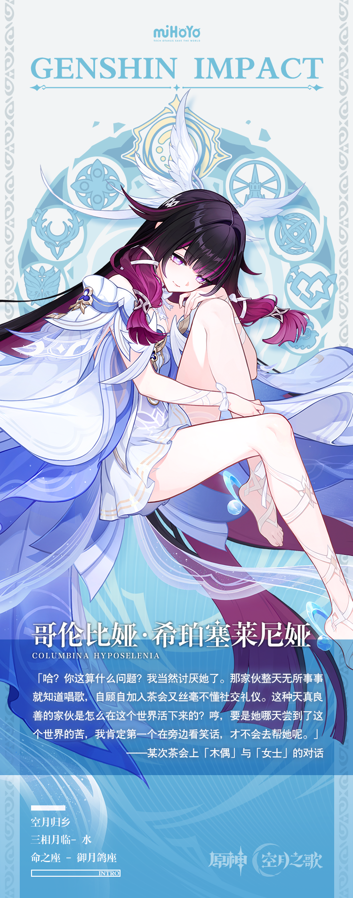

# 银天濯羽，新月重临

她走向死亡，而死亡也是新生；正如她行至终点，而终点也是她的原点。

世界处于世界诞生前的寂静。

直到一束引力掷向她，那力量足以将飞离的月亮拉回襁褓。月亮之径在她面前显现，那是迎接月神归乡的路。

她不再是遥远的水中之月，那个时常破碎又悄然复原的幻象。

她将在黑夜里唱响命运的铃歌，拨动潮汐，为月下众生带来自由与希望。

哥伦比娅睁开了双眼，仿佛自这一刻起，她才真正诞生在了这个世上。