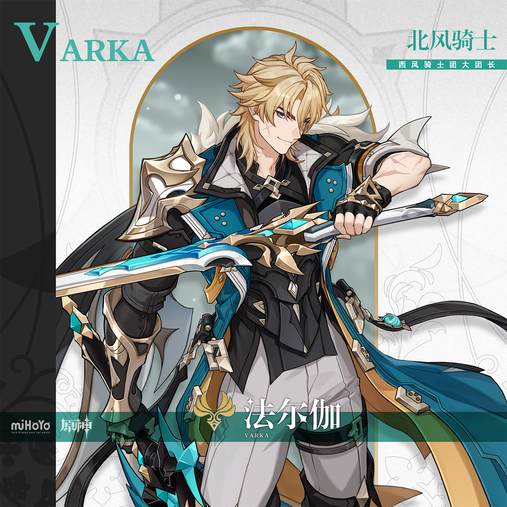
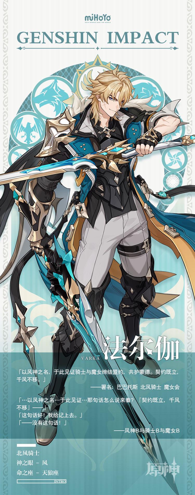

# 凡铁之剑，斩魔之锋

「老板，打几柄剑，用上最好的铁！」

铁砧台四溅的星火，像隐没于夜空的点点星芒。

「对了，多打一些，免得路上不够砍。」

一块凡铁，要经过多少次锤炼，才能随骑士奔赴战场。

……

「埋下这桶酒，等我们回来一起喝！」

酒庄外萦绕的果香，攀缘着藤蔓飘向天外远方。

「凯旋后的美酒，一定连巴巴托斯都能醉倒。」

一杯凡酒，要藏过多少个冬夏，才能等到骑士的归乡。

……

「就送到这里吧，再送远些，蒙德可就没人守咯！」

城门口送别的风声，像是在为远征的骑士祝唱。

「…剩下的路，都得靠我们自己走了。」

一介凡人，要走过多远的征途，才能开辟命运的新章。