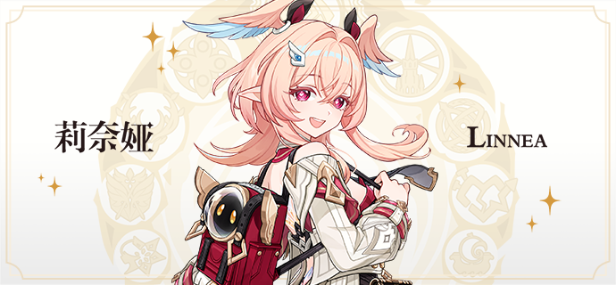
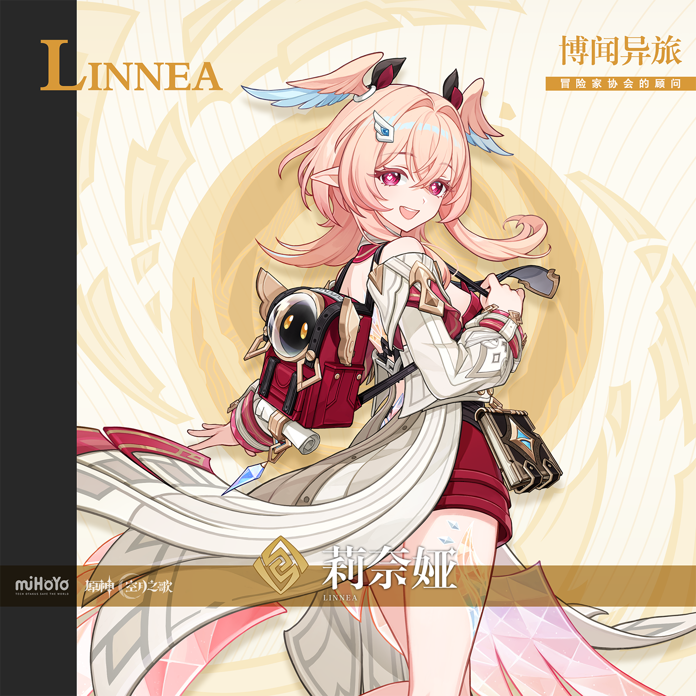
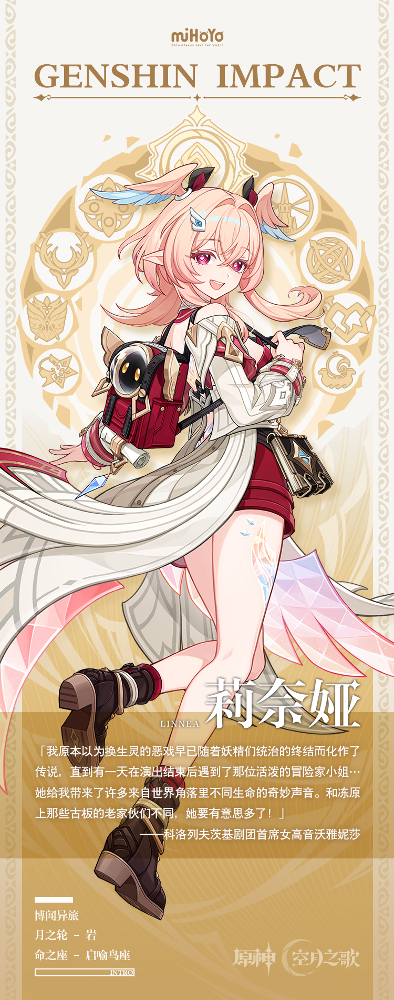

# 识谶循途，亦抵仙乡。

诞生于这个世界上的孩子，最初总会将自己当作世界的中心。意识到自身与世界的隔阂，往往是童年消逝的标志。但假如这个孩子是个生活在人类社会中的非人之物，情况又会如何呢？对她来说，成长的道路恐怕会更为苦涩吧。

虽然这里是挪德卡莱，怪人与怪物们的天堂。海螺帮的孩子们只会排除到了年纪的大人，冒险家协会的委托者也不会在乎接下他们委托的是什么样的人。但真正困难的问题永远源于自己——即便是那夏镇的孩子也会长大，最终他们会接受世界对他们的定义，在看似有着无数选择的道路中，踏出早已命定的足迹。无限的世界，从此坍缩为一。

但莉奈娅却没有办法做出这样的选择，在她的身边也没有人能告诉她那个最为重要的问题的答案。

好在这个世界是如此广阔。提瓦特大陆上有七个国家，至冬的冻原上常见的妖精有六种，光的虹彩能被散作七色，但在此之外呢？在云起之巅，浪下之地，还有许许多多美丽又奇特的生命，以及不曾为人所知的生态与秘境。它们未被任何一本图鉴收录，也未被纳入任何一种分类。而无法被分类的事物，便意味着无限的可能。

于是莉奈娅踏上了冒险之路。只要冒险的脚步没有停下，或许她便能赶在命运追上之前，走过每一条可被选择的道路。

这便是独属于莉奈娅的，与这个世界建立联系的方式。