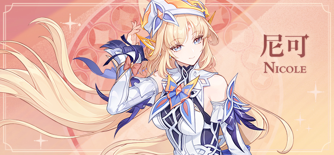
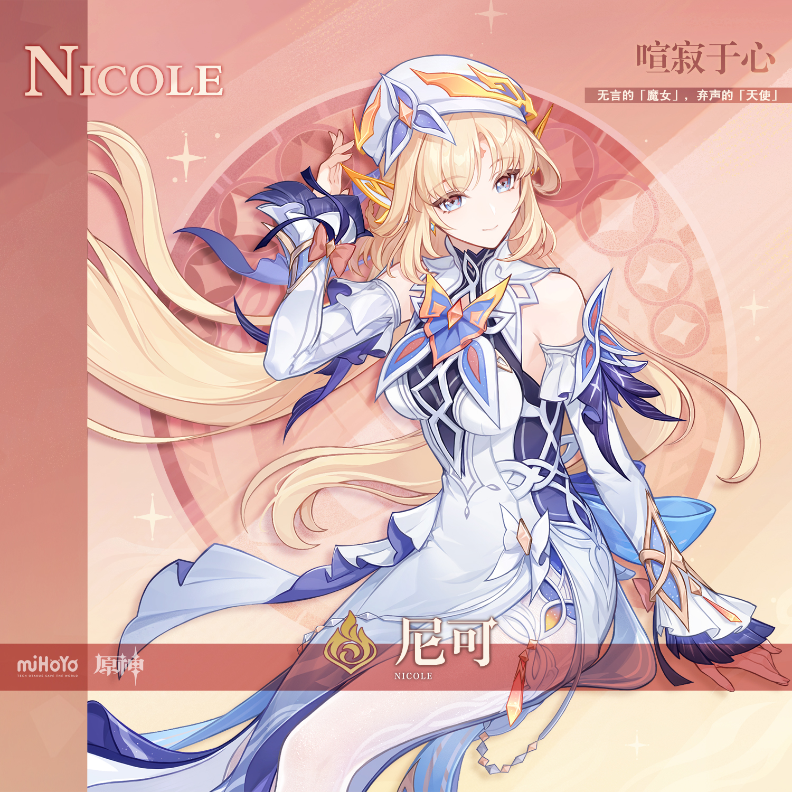
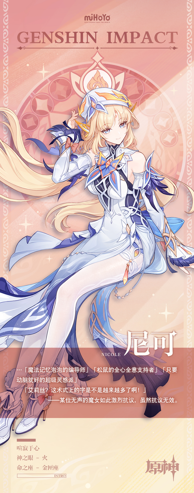

# 摒落天灵，代喻己心

尼可所构想的故事，许多都以「在很久很久以前…」开篇。

或许对于某些作者而言，「很久以前」只是逃避追问的借口——毕竟都说了故事发生在很久以前，如今，那些与故事有关的人或事都已烟消云散，无论如何都无法真的溯及过往。

但在尼可的脑中，那些「很久以前」的故事却从未消散。

很久以前，列邦的灯火曾经像金丝般缀满大地；很久以前，高天的女儿们曾经无忧无虑地行走在诸神的庭院与凡人的城邑间；很久以前，那坠入深黯的旧日之主尚未将灾厄带回他的故土；很久以前，高悬于夜空的三轮明月，其数依旧为三…

岁月不居，珠流璧转。乐园的火种在无望的轮回中与生息一同殄灭，原本忠心于主宰的侍仆为受造的生命而背叛，漆黑的龙主自星间归来，月色的高车如琉璃般破碎…

故事从未结束，可昔日的读者与听众皆已告别。曾经渴望执笔书写欢笑的天使失去了曾经让她欢笑的一切，甚至失去了欢笑的声音，再也无法发出一言。

就这样，尼可心里的故事，好像再也无法正式开篇。她只能怀揣着许多的「很久以前」，在大地上漫步，看着万事万物时过境迁。

直到她遇见了一个戴着大大帽子的小小魔女，那夸张的帽檐骄傲地几乎要翘上天，当然了，比现在的帽子还是小那么几圈。

小小魔女蹲在尼可身边，认真地听她讲了一个又一个故事，直到喝完了杯子里的饮料，吃完了包里的饼干。

「所以，你真的是天使？那些故事也是真的？」

「那就正好了，我是魔女，你是天使，刚好对应上了。」

快乐的小魔女伸出手，向着这位从「很久以前」跋涉而来的天使发出了邀请。

「要不要加入我的魔女会？我刚想出来的名字，好听吧。」

「我保证，它绝对会是整个提瓦特最有趣，最厉害，最好玩的同好会！」

「……」

还没等天使出声——她也出不了声——小魔女就一把抓住了她的手，把最后一颗糖塞给了她。

「这样，魔女的契约就成立了。」

虽然，彼时的尼可暂时没有加入的打算，也不知道这个名为「魔女会」的同好会将来究竟会变成什么样。

但至少…

它听起来，是一个足够快乐的地方。