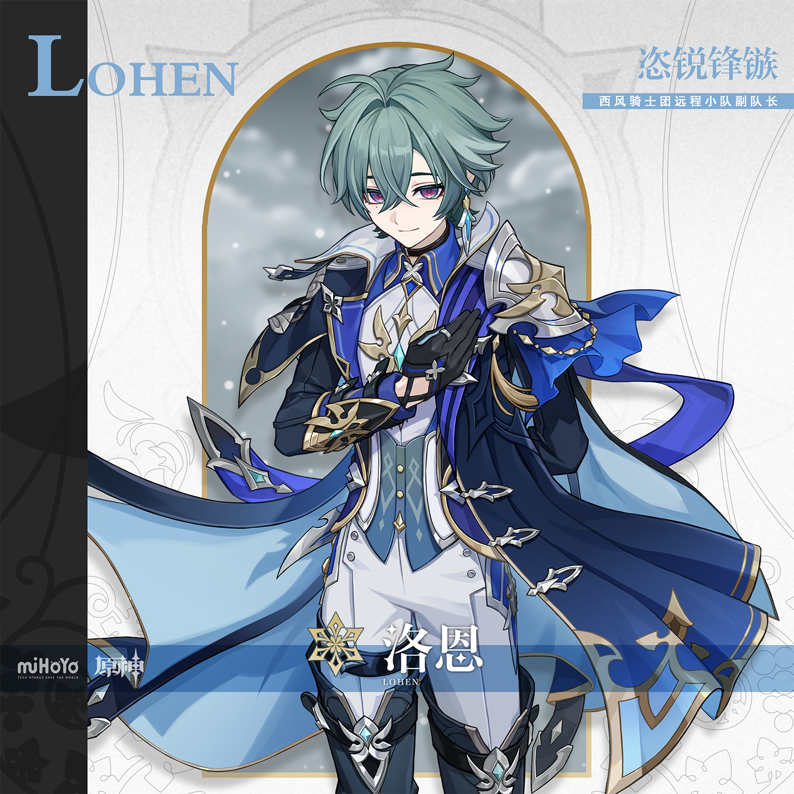

# 锋芒袭夜，鸣镝破噩

洛恩虽是远程小队的副队长，却很少用箭。

第一次与他同行的人，总会对这一点印象深刻——当队员们以弓弩与铳枪在后方架起阵线时，那位本该留在掩体后的年轻骑士，往往已经提枪越过防线，先一步迎上最危险的敌人。

有骑士问过远程小队的队员个中原由，而回答往往有两种：

只要他站在那里，就没有敌人可以迫近阵线，所有人都能放心为他提供火力支援。

只要他冲在前方，就没有敌人可以维持守势，于此他就是整支小队最锋锐的箭矢。

 

而洛恩自己给出的回答并不复杂：

「很多时候，我自己用枪捅上去，比箭更准还更快。」

对洛恩而言，武器和战术没有孰强孰弱，只有效率高低。当放冷箭就放箭，该上枪时就上枪。尽管用枪尖刺穿甲衣的手感最是令人愉悦，但若是为了更高效的胜利，设伏下毒奇袭潜入也不失为好手段。

只不过在他需要放冷箭的时候，往往不会留下什么目击者。

也因如此，他给人留下的印象，总是战场上那一抹执锐疾驰的迅影。

像破空而至的利箭与枪弹，却更是狠厉，也更不容躲闪。