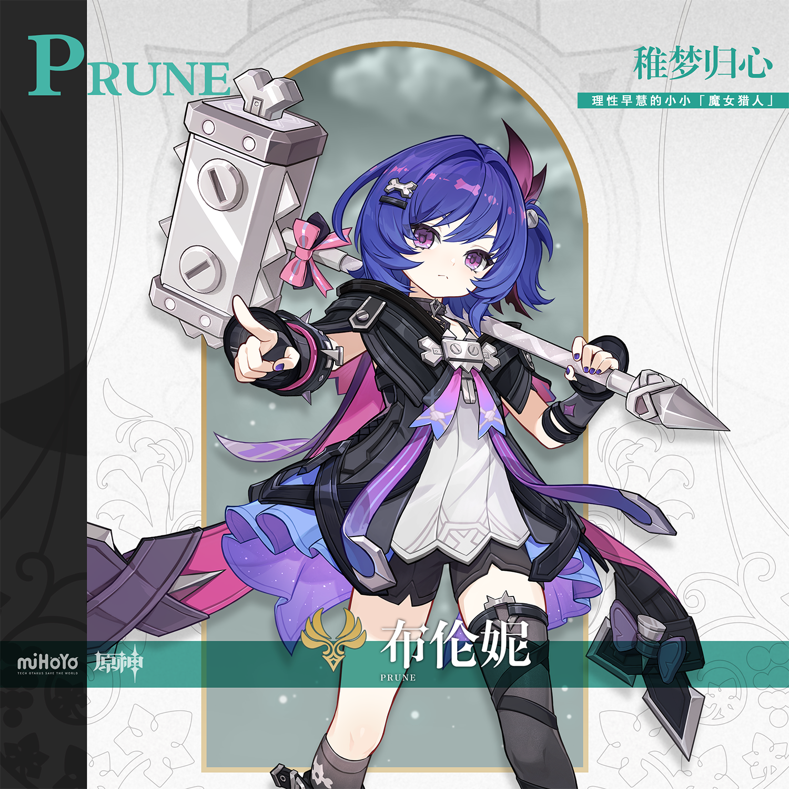
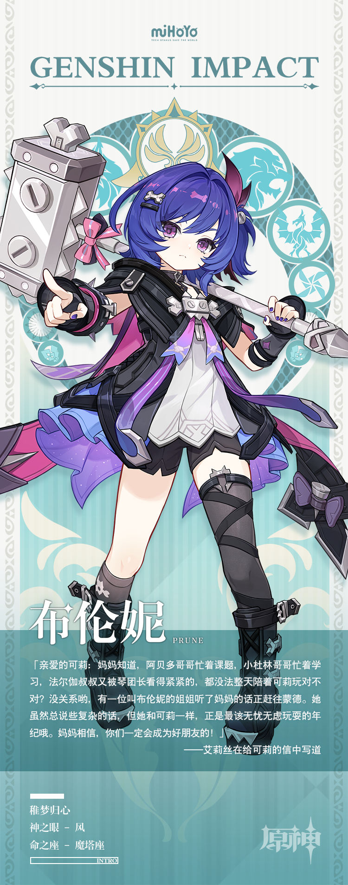

# 猎风追迹，幻伴同途

最近在蒙德城的街头巷尾，偶尔能遇见一位造型叛逆的特殊访客。

这位小小的猎人正处于人生中最重要的「狩猎期」，她用远超同龄人的眼光和智慧，沉着地解构着周遭的一切，仿佛早已看透了世界的运转法则。

她声称自己背负着沉重的宿命，从遥远的挪德卡莱一路追击至此，誓要向那位传说中的「大魔王」艾莉丝讨回公道。在她随身携带的那本旧书里，密密麻麻记录着关于魔女的情报和战术推演。说明此前她已做了不少准备工作，这番应战想必下定了某种决心。

布伦妮初到蒙德时，曾连夜在城里张贴了数十张针对艾莉丝的「讨伐檄文」。文中用词之辛辣、情感之真切，足以让任何一个被控诉的人羞愧难当。

然而，在这个充满了自由之风的城邦里，似乎没有人把她的「复仇宣言」当真。热心的蒙德市民还在旁边贴上了猎鹿人当日特供的打折券，生怕这位远道而来的小猎人饿着肚子无法复仇。

「可恶，舆论战术也不起效吗…难不成真要如她所说…」

就在她对着打折券陷入自我怀疑时，一个穿着红衣服的小女孩闯入了她的视野，对着她露出了灿烂的笑容：「布伦妮姐姐，我们一起去大冒险吧！」

她究竟是在等待猎物的出现，还是已经不知不觉地，落入了那个被大魔女精心编织的、名为「童心寻回」的温柔陷阱里了呢？