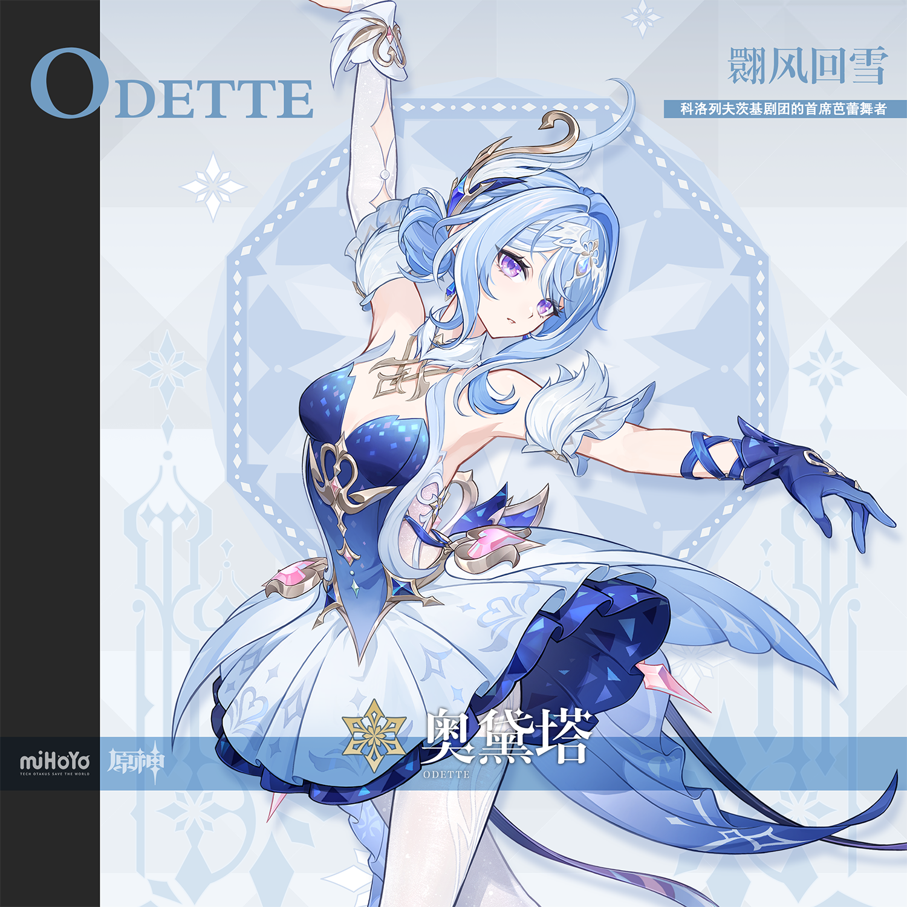

# 寂冬覆雪，振翎成旋

在至冬，要让冰封大地上的人们心甘情愿走进剧院，并非一件容易的事。寒风刺骨的日子里，人们更愿意缩在壁炉旁，而非踏雪去看一场演出。

但奥黛塔的芭蕾演出是个例外。

每当她的名字出现在剧院海报上，售票窗口前便会排起长队。不是因为她笑容甜美，事实上她几乎从不对观众笑；也不是因为她为人亲切，演出落幕，她不会在舞台多逗留一刻。人们来看她纯粹是因为，在她踮起足尖的刹那，连至冬呼啸的寒风都仿佛为之静止，而她精准的舞步，则令全场屏息。对追随她的观众而言，这份冰冷反而为其魅力锦上添花。

这位沐浴在聚光灯下的少女，同时亦是愚人众的一员。

剧团的排练在清晨，愚人众的训练在深夜，个人练习与突发任务则穿插其间。练功房里压腿压到极限后翩然起舞，训练场上击倒对手后转身赶往下一程，日复一日，她宛如音乐盒上的舞者，永不停歇地旋转，仿佛不知疲惫，也无须休息。

朋友曾经好奇地问她：「在芭蕾演出和愚人众之间奔波，不累吗？」

她偏了偏头，认真思索片刻，然后平淡地回答：「习惯了。」