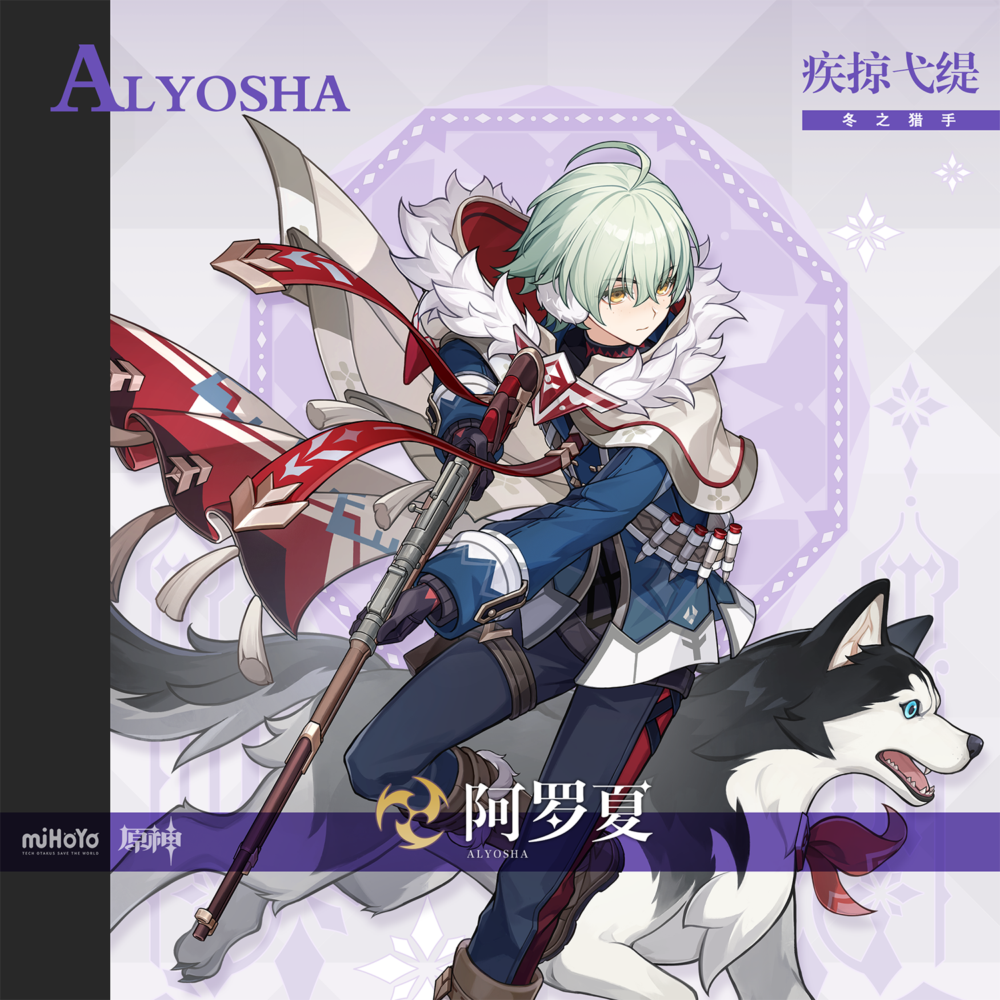
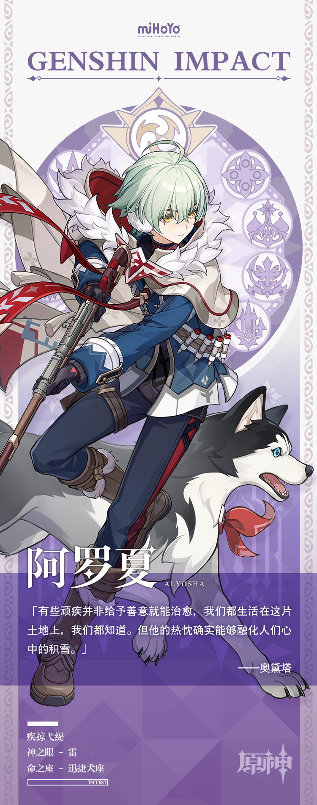

# 似隼疾掠，弋猎于冬

如果去向凝露镇上的人打听阿罗夏这个名字，大伙多半都愿意多聊上几句：

「他是个出色的猎手，嗅觉简直跟他养的猎犬一样灵敏！他还真能在这破天气里逮到兔子。」

「不止！你是没见到他抬起猎枪的架势，说他是军械宫的人我都能信。」

「尽瞎说。军械宫的人哪会住在这里啊？也不看看路有多远…」

「谁瞎说了。我可是亲眼看见他从魔物爪下救了人呢，嘭的一声，我还来不及捂耳朵，就看见魔物晃悠着倒下了…」

总而言之，这是一位公认的好小伙，淳朴、勇敢、热心…

等等，你不会忘了至冬的雪原有多么无情吧？

只要往雪里走过一回就能明白温暖的珍贵。寒风是严酷的，像一把锉刀磨削它所看到的一切。无尽的白雪倾泻着对这个世界的恨意，这还不够，它向践踏它的活物索取温度和生命作为代价。

如果有选择，几乎没人愿意在苦寒中停留。

可阿罗夏一次又一次将双脚埋进冰冷的雪地里，为了带回猎获，为了带回希望。

他举起枪，瞄准他眼前的猎物。

他真正的敌人是苦寒本身。