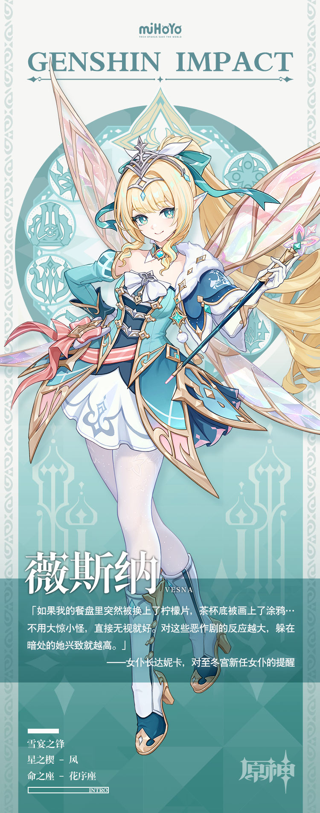

# 巡风执令，明光镇雪

在至冬，「丝翠维莎」是一个不容忽视的姓氏。

这支古老的风仙血脉早在至冬动荡未定之前起便已存在，跨越过无数风雪，承载着无数荣耀。

薇斯纳显然担得起这个姓氏。她明艳照人，从容得体，举止优雅，风度翩翩…在大多数时候。

随心所欲的薇斯纳从不被他人制定的礼数束缚，率性而为的她也常有不拘一格的惊人之举：有时是将火车开出足以喜提禁令的残影，有时是往同僚的餐盘里塞点精心挑选的酸柠檬片…

但不会有人因此质疑薇斯纳的高贵，她的荣耀从不浮于礼节与装饰，只寄托于锋刃之上。

「冬契军」是女皇亲执的剑刃，而薇斯纳更是其中最锐利的剑锋。

在风仙之中，薇斯纳的年纪并不大，甚至有些过于年轻。初入「冬契军」之际，她曾被称作「丝翠维莎家的小姑娘」，不过这个称号很快就随着她的身手与功绩被人忘却。

直到她正式接过「冬契军」总司令一职时，「薇斯纳」的名字，就已经耀眼到足够让人忘掉后面的「丝翠维莎」了。

历经数代，这个不容忽视的姓氏，终于再次迎来一个更不容忽视的名字。

或许对薇斯纳自己而言，她的荣耀所在，并非家族的姓氏，也非傲人的天资，而是她自身不变不移的信念：

为了女皇，为了至冬。

从过去如此，未来亦如此。一如古老的冰川，不论多么善变的风，都无法更易。