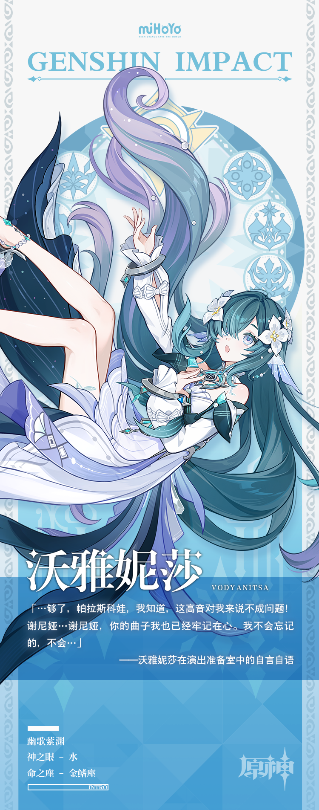

# 纵鳍梭跃，澄波吟咏

在久远的至冬，水妖们曾遍居城中，他们有的在舞台上高歌着颂歌，有的在街巷里欢唱着幽默小调，有的则喜欢钻进水里，用恍惚的歌声吸引人们去水边一探究竟，再猛地跃起，在笑声里把好奇者泼一脸水，而后又在岸边人好气又好笑的嚷嚷声里钻回水中，一摆尾巴便消失不见。

…但是，随着时光流转，至冬的舞台与街巷悄然失去了它们的歌者，水底的旋律也随着暗潮，无声地奔涌向了沉默的彼方，人们不安地暗中揣测，或许那水底的幽歌，会就此离他们远去吧…

不过，在某个早晨，人们却发现，沃雅妮莎依旧在科洛列夫茨基剧院登台献唱，就如同往昔的时光不曾褪却，旧日的欢乐一如往常。

几乎没人知道她留下来的理由——也没有人敢去当面提问，除非这个提问者做好了之后再也无法采访沃雅妮莎小姐的打算。

或许，是她不愿那些喜欢自己歌声的观众们失望？或许，是她不愿离开那座辉煌的演出场？又或许，是因为另外一些足够重要的原因，让她愿意逆流而上，即使要因此告别同族们，也再所不惜…？

对于观众们来说，细究这问题的答案实在毫无意义，唯一的重点是，他们仍然能听见沃雅妮莎的歌声，也仍然能为水妖的歌声而倾倒，这就足够了。

当然啦，如果你想要为水妖的歌声而倾倒…

「站票？呃，我们剧场暂时没有…不，自己带椅子也不行。」

「打开门？这样里面的观众会很冷的…」

「抱歉，我们剧场暂时不招临时清洁工！」

…首先，你得先买到票。