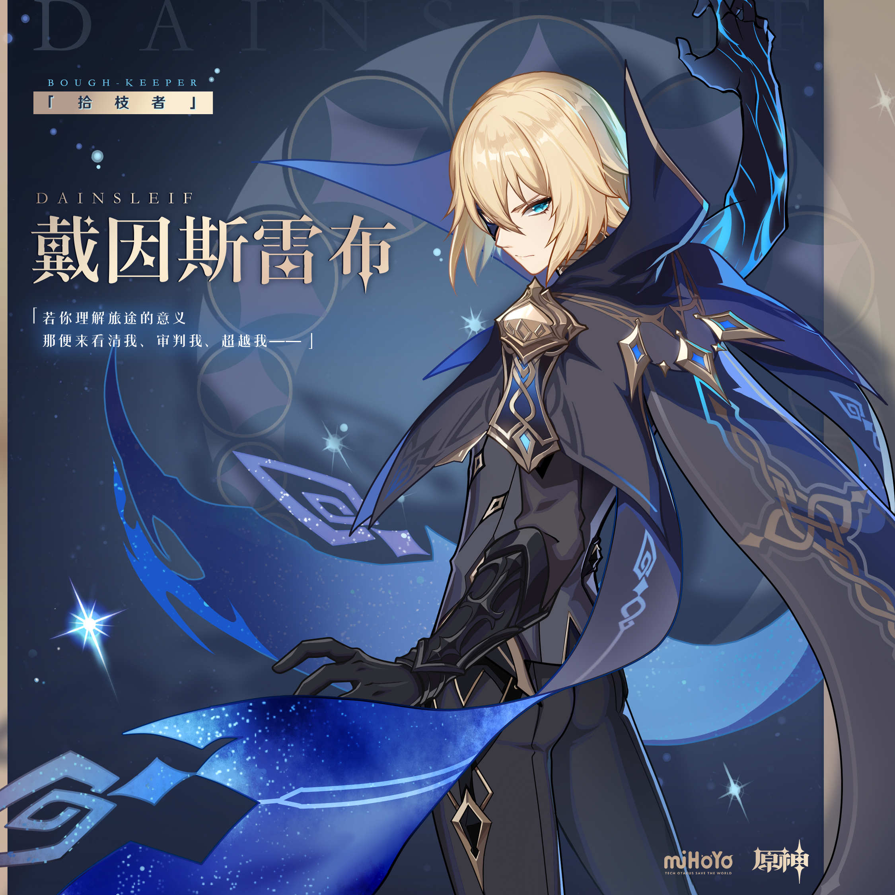
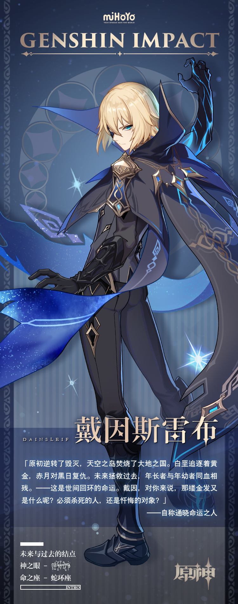

# ▌「拾枝者」 ·戴因斯雷布

未来与过去的结点

===============================

「原初逆转了毁灭，天空之岛焚烧了大地之国。白垩追逐着黄金，赤月对黑日复仇。未来拯救过去，年长者与年幼者同血相残。——这是世间回环的命运。戴因，对你来说，那缕金发又是什么呢？必须杀死的人，还是忏悔的对象？」

​                                        ——自称通晓命运之人

